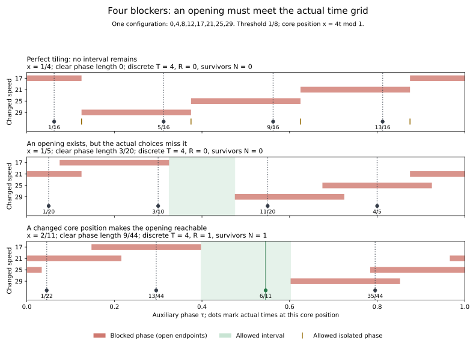

# Four changed runners: overlap must produce a reachable opening

September 24, 2026. Vance approved the four-exception continuation, asking throughout the investigation for patterns, anomalies, and significant distinctions. The AI supplied the following arguments, exact computations, source comparison, and visualization.

**Status:** OBSERVED for the specified finite calculations. The general constructions, phase classifications, and finite reduction are HYPOTHESIS/proof candidates pending independent review. Pre-jumps are an established technique (S15); no novelty or arbitrary-speed result is claimed. All statements concern reference 0 among eight common-start runners. The threshold remains 1/8, and equality counts.

## 1. What this step answers

Study

\[
V_{q,\mathbf s}=\{0,q,2q,3q,4q+s_4,5q+s_5,6q+s_6,7q+s_7\},
\quad q\ge3,\quad s_k\in\{-1,1\}.
\]

There are sixteen sign choices. The three unchanged moving runners form the core. All eight speeds are distinct because adjacent changed speeds differ by at least q-2>0, and the smallest changed speed exceeds 3q.

The previous individual-count bound gives only q-4ceil(q/4), which is never positive. We now exhibit all three relevant possibilities in one configuration:

1. The four blocking arcs fit together with no positive overlap, leaving only equality points.
2. A changed core phase forces overlap and creates a positive interval, but the actual candidate times miss it.
3. A further change of core phase places an actual candidate in that interval.

This directly addresses the missing step in an auxiliary-gap argument. A gap must meet the actual trajectory. We provide a construction guaranteeing this for every q>=7, and exact certificates for the complete 64-case remainder q=3,4,5,6. Thus the proposed conclusion is **strict separation above 1/8 for every configuration in this family**. It is not a formula for the maximum, an all-reference statement, or a solution of the general conjecture.



All three panels use the same actual speeds {0,4,8,12,17,21,25,29}. Colored intervals show the frozen auxiliary system. Only the marked choices are actual times at that core position. The first panel's isolated equality phases are retained; zero interval length is not absence of valid auxiliary points.

## 2. Keep the two coordinates and the actual constraint distinct

Let x=qt modulo 1. The core positions are x,2x,3x. At a frozen x, introduce an auxiliary phase tau and write the four remaining positions as

\[
kx+s_k\tau\pmod1,\qquad k=4,5,6,7.
\]

The actual common-start system uses tau=t and x=qt. At a fixed x its possible times on [0,1] are exactly

\[
t_j=\frac{x+j}{q},\qquad j=0,\ldots,q-1.
\]

Indeed, (kq+s_k)t_j=kx+kj+s_kt_j. The integer kj disappears modulo 1. This is a core-preserving pre-jump, not an independently chosen starting position.

Since s_k=±1, multiplication by s_k preserves distance to the nearest integer. Each exceptional distance is

\[
\|kx+s_k\tau\|=\|\tau+s_kkx\|.
\]

Its forbidden set is an **open** arc of radius 1/8 centered at
\(c_k=-s_kkx\pmod1\). Every arc has length 1/4. Their individual lengths sum to exactly one.

Let M(tau) count active blockers. Let G be the measure of phases with no blocker and R_phase the integral of max(M-1,0). Because the individual lengths sum to one,

\[
G=R_{\mathrm{phase}}.
\]

This continuous identity says overlap leaves an equal amount of uncovered phase. It does not count which actual times occur there.

For the q actual choices, define

\[
T=\sum_{j=0}^{q-1}M(t_j),\quad
R=\sum_{j=0}^{q-1}\max(M(t_j)-1,0),\quad
N=\#\{j:M(t_j)=0\}.
\]

Then the separate discrete identity is

\[
N=q-T+R.
\]

R counts duplicate blocking beyond the first blocker, not the sum of all pair intersections, which would overcount triple and quadruple collisions. The script checks both identities exactly and retains their different units: phase lengths versus counts of actual choices.

## 3. Exact quarter-tiling at the core's best position

The core x,2x,3x has maximum nearest distance 1/4, achieved only at x=1/4 or 3/4. This follows from the four-position circle-spacing bound used in the earlier notes.

At x=1/4, the forbidden-arc centers are

\[
0,\quad -s_5/4,\quad 1/2,\quad -3s_7/4\pmod1.
\]

The signs s4 and s6 disappear from these centers. There are two cases:

| Sign relation | Frozen allowed phases at x=1/4 | Clear phase length G |
|---|---|---|
| s5=s7 | {1/8,3/8,5/8,7/8} | 0 |
| s5=+1, s7=-1 | [1/8,3/8] together with {5/8,7/8} | 1/4 |
| s5=-1, s7=+1 | [5/8,7/8] together with {1/8,3/8} | 1/4 |

When s5=s7, the centers are all four quarter positions. The four open quarter arcs tile the circle in measure, leaving their four common boundaries safe. There is no positive-length overlap to force room. This is a real obstruction at this chosen core position.

For those eight sign choices, an actual time satisfies both x=1/4 and one of the allowed odd eighths only when q=2 modulo 4. Substituting t=r/8 into qt=j+1/4 gives qr=8j+2. Since r is odd, this is possible exactly for that residue class of q. There are two surviving choices for this core phase, both at equality. All other q have none. Reflection supplies the x=3/4 behavior.

This obstruction persists at arbitrarily large q in the excluded residue classes. A larger number of repetitions cannot turn an equality-only frozen set into a positive interval.

## 4. Changing the core phase forces overlap arithmetically

Choose x=1/5 instead. The core distances are 1/5,2/5,2/5, all strictly above 1/8. Every exceptional arc center now belongs to the five-point grid

\[
\{0,1/5,2/5,3/5,4/5\}.
\]

Four centers cannot occupy all five points. Even allowing coincident centers, some cyclic gap between consecutive distinct centers has length g>=2/5. Around the middle of this gap, the open blocking arcs leave a closed allowed interval of length at least

\[
g-\frac14\ge\frac25-\frac14=\frac3{20}.
\]

More generally, if the cyclic center gaps are g_i, the clear length is
\(G=\sum_i\max(g_i-1/4,0)\). This also handles coincident centers by first retaining their distinct positions; blocker multiplicity remains in M and its integral.

Thus G>=3/20 and R_phase>=3/20 for every sign choice at this core phase. The quarter arcs cannot tile perfectly when their centers are constrained to fifths. **This arithmetic incompatibility is what forces overlap here.** It is specific to the chosen family and phase; it does not establish a universal overlap law.

The core's own minimum distance decreases from 1/4 to 1/5, yet this can improve the combined outcome. Maximizing the core alone need not locate useful times for the full configuration.

## 5. Make the opening reachable: all q>=7

Let tau0 be the midpoint of a largest center gap at x=1/5. Every exceptional distance at that auxiliary point is at least g/2>=1/5. The actual grid t_j=(1/5+j)/q has spacing 1/q on the phase circle. Choose its nearest point by

\[
j=\left\lfloor q\tau_0-\frac15+\frac12\right\rfloor\pmod q,
\qquad
t=\frac{1/5+j}{q}.
\]

Circular distance between t and tau0 is at most 1/(2q). Each auxiliary exceptional distance is 1-Lipschitz in tau. The core positions are exactly preserved. Therefore

\[
\min_{v\in V_{q,\mathbf s}\setminus\{0\}}\|vt\|
\ge \min\left(\frac15,\frac g2-\frac1{2q}\right)
\ge\frac15-\frac1{2q}>\frac18
\qquad(q\ge7).
\]

At q=7 the conservative margin is already 1/280. This realizes an actual common-start time; it does not leave x and tau independent. No simulation or exhaustive enumeration over unbounded q is needed for this step.

For q=3,4,5,6 there are exactly 4*16=64 sign/parameter combinations. The checked-in data give a rational witness and a closed interval certificate for every one. The witness is the midpoint of a positive component of the exact allowed set. Each certificate independently checks every runner's affine phase at both interval endpoints, so the full interval is valid. The smallest selected point distance among these 64 certificates is 51/352>1/8.

Together the analytic construction and the complete finite remainder form the proposed all-q>=3 argument. Its status remains an unreviewed proof candidate. Seven is a sufficient cutoff, not a claimed sharp cutoff; tightening it is unnecessary for this result.

## 6. One configuration separates three different notions of room

Use q=4 and all signs positive, giving speeds

\[
\{0,4,8,12,17,21,25,29\}.
\]

| Core phase x | Core minimum | Continuous clear length G=R_phase | Discrete T | Discrete R | Actual survivors N |
|---|---|---|---|---|---|
| 1/4 | 1/4 | 0 | 4 | 0 | 0 |
| 1/5 | 1/5 | 3/20 | 4 | 0 | 0 |
| 2/11 | 2/11 | 9/44 | 4 | 1 | 1 |

At x=1/4, the only auxiliary safe phases are odd eighths. The actual times are (1,5,9,13)/16, none of which is safe.

At x=1/5, the four centers are 0,1/5,3/5,4/5. The positive allowed interval is [13/40,19/40]. The actual times are 1/20,3/10,11/20,4/5. All miss the interval. Continuous overlap exists, but none of these four choices lands in that overlap or in the uncovered interval. The discrete blocking sets still partition the actual choices.

At x=2/11, the centers are 1/11,3/11,8/11,10/11. The allowed interval is [35/88,53/88], of length 9/44. The actual times are 1/22,13/44,6/11,35/44. Now 6/11 lies inside the opening, while the last choice is blocked twice. T stays four, and the one unit of duplicate blocking creates one survivor via N=4-4+1.

At t=6/11 the full minimum is 2/11. The exact maximum of this configuration is also 2/11, attained at 5/33,5/11,6/11,28/33. These maximum claims are exact checks for this configuration, not a formula for the whole family.

The middle row is a counterexample to the statement that positive auxiliary overlap or a positive auxiliary gap automatically supplies a valid time on a fixed pre-jump grid. The last row shows how changing the core phase repairs the specific failure.

## 7. An isolated frozen point can start a real interval

Consider q=6 and t=3/8, so the actual core phase is x=1/4. Compare:

| Exceptional speeds | Frozen allowed set at x=1/4 | Actual component containing t=3/8 |
|---|---|---|
| 25,31,37,43 | Four isolated odd eighths | {3/8} |
| 25,31,35,43 | The same four isolated odd eighths | [3/8,55/144] |

In the first configuration, speed 37 is entering its blocked region at phase 7/8 and speed 43 is leaving at phase 1/8. They block opposite sides of the time, making it isolated. Their sum is 80, a multiple of eight, consistent with the earlier necessary condition for opposing threshold contacts.

After changing 37 to 35, both 35 and 43 have phase 1/8 at that time and leave their blocked regions together. The actual trajectory opens to the right; core speed 18 closes the interval at 55/144.

The frozen centers at x=1/4 do not distinguish the two signs of the 6q term. The actual trajectories do, because x also moves when time moves. Thus an auxiliary singleton is not necessarily a singleton of the physical allowed-time set. Boundary position alone does not determine boundary crossing direction.

## 8. The core ceiling does not follow a universal staircase

The core caps every full maximum at 1/4. Equality can be classified exactly in this family:

\[
\max_t\min_{v\in V_{q,\mathbf s}\setminus\{0\}}\|vt\|=\frac14
\iff
\begin{cases}
s_5=+1,\ s_7=-1,\ q\equiv1\pmod4,\quad\text{or}\\
s_5=-1,\ s_7=+1,\ q\equiv3\pmod4.
\end{cases}
\]

The signs s4 and s6 are arbitrary in this equivalence. When it holds, the complete maximizing set on [0,1] is {1/4,3/4}.

To derive it, a full 1/4 maximum requires x=1/4 or 3/4. The 4q and 6q terms at either phase force tau=1/4 or 3/4 to keep both distances at least 1/4. At t=1/4, the remaining conditions reduce to nonzero residues of 5q+s5 and 7q+s7 modulo four, giving precisely the cases above. Reflection gives t=3/4. These times are the only possibilities; even q cannot make the core optimal there.

Twelve of the 96 computed configurations attain this ceiling. The rest have maxima strictly between 1/8 and 1/4. In particular, four changes do not automatically continue the earlier 1/8 -> 1/7 -> 1/6 pattern to a universal 1/4 value. A count of changed speeds alone misses the sign and residue information.

## 9. Sources, reproducibility, and limits

S15, Kravitz (2021), Section 2, supplies the established pre-jump framework; its paragraph was revisited for this continuation. Our earlier FAST_CLUSTER.md used a related quarter-arc tiling observation. Here the core itself scales with q, and the variable tau is rounded onto a fixed-core-position time grid. The particular fifth-grid construction, finite remainder, and contact classification above are our AI-generated synthesis awaiting review. We have not established novelty. S16–S17 remain related context, not substituted proofs of these claims.

Run from the repository root:

```sh
python -m scripts.analyze_four_perturbations
python -m scripts.analyze_four_perturbations --figure
```

The analysis uses exact standard-library fractions. Optional plotting requires Matplotlib. Inputs q=3..6 exhaust the complete finite remainder; q=7 and 8 are diagnostics at and above the analytic cutoff. Every q has all sixteen signs. The only additional full configuration is the unchanged q=4 baseline, which stays exactly tight at 1/8 with zero clear duration. The phase and contact comparisons reuse existing configurations.

All 97 complete maximum/peak comparisons and all 97 boundary reconstructions pass. The script checks 66 specified sign/phase inputs, 386 actual grid profiles including reflections, 2,120 grid choices, and 96 strict interval certificates. The latter consist of 64 finite-remainder certificates and 32 analytic-range diagnostics. Reflections and repeated geometric patterns are included in these counts; they are not independent samples.

Frozen allowed sets are computed by affine interval intersections and separately by exact boundary-cell classification. Actual allowed sets are likewise reconstructed by interval intersection and a boundary method. Maxima are found from all rational affine corners/crossings and crosschecked by feasibility at that value. Every finite-case witness interval has direct endpoint-phase certificates. JSON retains all peak times, blocking memberships, frozen allowed sets, exact accounting, contact controls, source hashes, and compact hashes/counts/durations of complete actual allowed unions.

Existing helpers and the checker were not changed; their broader regression suite was not rerun. These crosschecks do not constitute independent mathematical review. The next useful question is what remains when exceptional offsets have unequal magnitudes, so their forbidden sets no longer all become simple translates of the same quarter arc in tau. That would require a new specified scope. Arbitrary-speed coverage, genuinely zero-margin auxiliary limits, and independent review remain OPEN. No broad scan, external outreach, or main-branch merge is authorized by this note.
