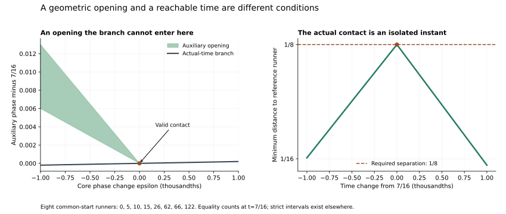

# Local escape from changed tilings: relative motion and arithmetic alignment

September 25, 2026 (UTC). Continuation of [TILING_ESCAPE.md](TILING_ESCAPE.md). AI supplied the derivation, implementation, exact evidence, and figure.

**Status:** the specified finite calculations are **OBSERVED**. The general local rule, sufficient cutoff, and unbounded residue arguments are **HYPOTHESIS / proof candidates awaiting independent review**. Originality is unestablished. Eight common-start runners, selected reference 0, threshold 1/8; equality counts.

## 1. What survives the change of arrangement

The previous example had equal total gap growth on either side of a tiling, but four gaps on one side and two on the other. That equality follows from a local conservation identity: boundary-velocity differences sum to zero around the circle. The positive differences create gaps in one direction; the negative differences create gaps in the other. Their total magnitudes agree.

This geometry does not determine which actual times reach the gaps. A change that preserves the entire auxiliary geometry up to rotation can change the arithmetic period from eight to sixteen and make previously unreachable threshold contacts reachable. Another example has period twenty-four. A reachable contact may be an isolated instant, even though auxiliary gaps open nearby.

The proposed generalization below covers positive coefficients with offsets 1,1,2,2 at a strictly safe core phase admitting a tiling. It gives a **uniform sufficient bound q>=8**, independent of the coefficient sizes. This is a conditional local construction, not a classification of arbitrary offsets, signed coefficients, unsafe core phases, or configurations without a tiling.

## 2. Scope and moving boundaries

Fix integers a_i>=4 and b=(1,1,2,2). Consider

\[
V_q=\{0,q,2q,3q,a_0q+b_0,a_1q+b_1,a_2q+b_2,a_3q+b_3\},
\qquad q\in\mathbb Z,\quad q\ge3.
\]

Assume that at some x0 in (0,1):

1. the core is strictly safe: ||k x0||>1/8 for k=1,2,3;
2. the four open auxiliary blocking sets ||b_i tau+a_i x0||<1/8 tile the circle in measure.

The criterion in [TWO_DOUBLED_OFFSETS.md](TWO_DOUBLED_OFFSETS.md), Section 2, characterizes such tilings. In particular, the two unit phases differ by 1/2, so x0 is rational. The four blockers consist of six open arcs, with lengths 1/4,1/4,1/8,1/8,1/8,1/8. Their endpoints leave six allowed equality contacts. They do not cover those contacts.

Put r_i=a_i/b_i. When x changes to x0+epsilon, both endpoints of blocker i translate by -r_i epsilon. These are exact affine motions, not a first-order approximation.

The four r_i are distinct at a common-start tiling. Equal r values at equal b would give identical blockers. Equal r values across b=1 and b=2 would make the doubled blocker overlap the unit blocker around a shared center. Either contradicts tiling in measure. Consequently all six contact differences below are nonzero. The tiling assumption also excludes repeated coefficients within either equal-b pair. With q>=3 the eight actual speeds are distinct: different integer coefficients cannot be canceled by an offset difference of at most one, and all four exceptions exceed 3q.

## 3. The local conservation identity

List the six arcs cyclically. At contact c_j let r_L be the ratio belonging to the arc ending there, and r_R that of the arc beginning there. Define

\[
\Delta_j=r_L-r_R.
\]

For epsilon>0, this contact opens a gap exactly when Delta_j>0, of width Delta_j epsilon. For epsilon<0, it opens when Delta_j<0, of width |Delta_j epsilon|. In the opposite direction the adjacent blockers overlap.

Every arc ratio occurs once positively and once negatively in the cyclic sum, hence

\[
\sum_{j=1}^{6}\Delta_j=0,
\qquad
K=\sum_{\Delta_j>0}\Delta_j
=-\sum_{\Delta_j<0}\Delta_j
=\frac12\sum_{j=1}^{6}|\Delta_j|>0.
\]

Choose H>0 sufficiently small that different contact clusters do not cross and the core remains strictly safe. Then the complete total auxiliary clear length is

\[
G(x0+\varepsilon)=K|\varepsilon|,
\qquad |\varepsilon|\le H.
\]

Thus equal total growth on the two sides survives every tiling covered by these assumptions. The number and placement of gaps can differ. The local invariant is the sum of absolute differences of neighboring boundary velocities; a shared rotation changes none of those differences.

For an abstract tiling with independently supplied starting phases, K could be zero. The cyclic identity then forces every neighboring velocity to agree, so the entire tiling merely rotates. A control below preserves this exception. Common-start tilings under the present assumptions exclude it.

### A uniform certified neighborhood

For each neighboring pair of distinct contact locations c_j,c_{j+1}, let d_j be their positive circular spacing. Each contact has two boundary velocities. Let S_j be the largest absolute difference between a velocity at the first contact and one at the next. Terms with S_j=0 impose no collision bound. Also put

\[
R_{\rm core}=\min_{k=1,2,3}
\frac{\min(\{kx0\}-1/8,\;7/8-\{kx0\})}{k},
\qquad M=\max_i r_i.
\]

Put d=denominator(x0) in lowest terms. The tiling criterion gives

\[
8\mid d,
\qquad d\le2|a_1-a_0|<2M.
\]

Here 8 divides d because one of (a_2-2a_0)x0 and (a_3-2a_0)x0 has fractional part 3/8, and the other 5/8. Also (a_1-a_0)x0 has fractional part 1/2, so d divides 2(a_1-a_0). The strict inequality follows from positive unit coefficients and M>=max(a_0,a_1).

Since 1/8 is an integer multiple of 1/d, strict core safety gives a phase margin of at least 1/d for every core runner. Therefore

\[
R_{\rm core}\ge\frac1{3d}>\frac1{6M}.
\]

Every contact spacing d_j is either 1/8 or 1/4, and every velocity difference S_j is strictly less than M because all ratios r_i are positive. Consequently the single choice

\[
\boxed{H=\frac1{8M}}
\]

is strictly below every contact-collision radius d_j/S_j and the core-safety radius. The largest boundary translation is 1/8. This certifies the same local geometry for arbitrary coefficient sizes under the stated assumptions. For the original example H=1/96; its previously certified larger neighborhood 1/56 remains valid. This uniform neighborhood is sufficient, not maximal.

For every tested profile, a separate affine-cell calculation certifies the geometry throughout this neighborhood. Each runner's phase lies in one fixed allowed or blocked strip over each cell; four vertex inequalities certify the whole cell by linearity. Exact interval intersection and independent boundary reconstruction also check the frozen slices at zero, H/2, and H on both sides. All original equality points are retained at zero.

## 4. Exact reachability, with isolated contacts separated out

Write s=sign(Delta), A=max(r_L,r_R), B=min(r_L,r_R), and h=|epsilon|. Here A>B>0. The gap near contact c is

\[
[c-Ah,c-Bh]\quad(s=+1),\qquad
[c+Bh,c+Ah]\quad(s=-1).
\]

At frozen x, actual common-start times satisfy

\[
t_j=(x+j)/q,\qquad j=0,\ldots,q-1.
\]

Their slope in the (epsilon,tau) plane is 1/q, while all blocking boundaries have negative slopes. They approach each gap from one specific side.

Let z=qc-x0. For s=+1, choose the greatest integer j **strictly below** z and set rho=z-j. For s=-1, choose the least integer j **strictly above** z and set rho=j-z. Thus

\[
0<\rho\le1.
\]

Reduce j modulo q, with a corresponding lift of c when needed. Substitution into the gap inequalities gives

\[
h_{\rm enter}=\frac{\rho}{Aq+1},
\qquad h_{\rm exit}=\frac{\rho}{Bq+1}.
\]

If h_enter<H, the portion between h_enter and min(h_exit,H) supplies a strict interval. Its entry endpoint meets the threshold exactly. Farther approaching branches replace rho by rho+1,rho+2,..., so cannot arrive earlier at that gap. The minimum of the six entry expressions is therefore the nearest positive-length feasible component to the tiling whenever that minimum is below H. This is a distance in core phase, allowing either direction, not the first lonely time after the race starts.

The strict integer choice matters. If z is an integer, t=c is already an actual allowed point at x0. It must be recorded separately. Substituting rho=0 into the entry/exit formulas would produce a zero-length interval and fail to locate the next strict interval. The nearest approaching branch instead has rho=1.

Moreover, each such actual equality point is isolated. At a tiling contact, one positive-speed runner has phase 1/8 and another has phase 7/8. Decreasing actual time puts the first below 1/8; increasing time puts the second above 7/8. Thus both immediately adjacent time intervals are blocked. An auxiliary gap nearby does not change this local fact about that actual branch.

### The uniform q>=8 implication

Some opening has A=M. Its mismatch is at most one, so for every integer q>=8,

\[
h_{\rm enter}\le\frac1{Mq+1}<\frac1{8M}=H.
\]

Its exit is later than its entry because A>B, so a strict interval exists before min(h_exit,H). This constructs a strict actual witness for **every q>=8 and every coefficient choice satisfying Section 2**. No upper bound on coefficient size is imposed. The proof candidate does not assert failure for smaller q or sharpness of eight.

This cancellation of scales is useful: the denominator can shrink the core margin, but its size is bounded by the coefficients that also set the boundary speed. The normalized margin M*R_core stays above 1/6. Merely observing a small unscaled core margin would miss this constraint.

## 5. Which periodicity is preserved?

For a fixed rational tiling, let P be the least common multiple of the six contact denominators. The six mismatches rho, including the convention rho=1 at an exact zero contact, depend only on q modulo P. Eight is not universal.

Within a residue class, comparing rho/(Aq+1) with rho'/(A'q+1) reduces to the sign of the affine expression

\[
(\rho'A-\rho A')q+(\rho'-\rho).
\]

Hence each pair can change order at most once unless it ties identically. The first-entry pattern is eventually periodic in its choice of contact, with a rational expression in q for the displacement. A period alone does not guarantee that the same contact wins for every small q in that residue. The script selects an eventual winner by (rho/A,rho), then certifies a cutoff for all comparisons. For the four profiles tested here, the comparisons already hold for every q>=3; identical ties are allowed.

Once its entire component is inside the local neighborhood, an approaching branch's valid time width is

\[
\ell_t=\frac{\rho(A-B)}{(Aq+1)(Bq+1)}.
\]

Within each residue it shrinks as 1/q squared; the phase displacement shrinks as 1/q. This extends the two scales found previously. It does not say that the witness time itself approaches the start of the race at that rate.

## 6. Four targeted changes and the counterchecks

Each coefficient vector below is ordered against b=(1,1,2,2). The gap counts refer to epsilon positive/negative. Q is the general sufficient cutoff above.

| Profile | Coefficients a | x0 | K | Gap counts + / - | Contact period P | H | Q |
| --- | --- | --- | ---: | --- | ---: | --- | ---: |
| Original | (4,12,10,22) | 3/16 | 14 | 4 / 2 | 8 | 1/96 | 8 |
| Shared shear | (5,13,12,24) | 3/16 | 14 | 4 / 2 | 16 | 1/104 | 8 |
| Changed cyclic velocities | (4,12,10,6) | 3/16 | 11 | 3 / 3 | 8 | 1/96 | 8 |
| Different contact arithmetic | (4,16,11,29) | 5/24 | 21 | 2 / 4 | 24 | 1/128 | 8 |

The old original-family argument already covers q>=5 with a stronger specialized analysis. The uniform Q=8 here does not replace or weaken that record. No conclusion for every coefficient choice at q=3..7 is claimed.

**Same geometry, changed arithmetic.** Replacing every a_i by a_i+m b_i changes each auxiliary phase to b_i(tau+m x)+a_i x. For every fixed x this is a common rotation in tau, so the entire auxiliary allowed geometry, including its total length, is preserved up to rotation. At x0 the contacts shift by -m x0. With m=1, the original period-eight contacts become period-sixteen contacts. The original tiling has no actual equality point for any integer q; the sheared one has one for residues q=1,5,7,9,13,15 modulo 16.

At q=5, the sheared actual speeds are {0,5,10,15,26,62,66,122}. Time 7/16 is an isolated threshold contact. Its controllers are speeds 62 and 66. On the exact interval |t-7/16|<=1/1000 the minimum distance is

\[
\begin{cases}
1/8+62(t-7/16),&t\le7/16,\\
1/8-66(t-7/16),&t\ge7/16.
\end{cases}
\]

The two affine pieces are certified against all seven speeds. Strict separation occurs elsewhere; for example the complete component [337/528,623/976] has strict interior. The nearest positive-length component in core phase begins at h=1/264, while the nearest feasible phase including equality is already x0.

**A positive gap can still miss the actual grid.** For both the original and sheared q=5 systems, epsilon=+1/10000 and -1/10000 give total clear length 7/5000 but no actual survivor. At epsilon=0, the original has none and the sheared system has the single valid time 7/16. This directly rejects an implication from arbitrarily small positive auxiliary room to an immediately reachable time.

**Period eight fails in the changed arithmetic.** The last profile has an actual tiling contact for q=5,11,17,23 modulo 24. For q=5 it occurs at time 1/24; for q=13 there is none. Thus adding eight need not preserve even the existence of a tiling contact. Its q=5 strict component [67/152,173/392] coexists with the isolated time 1/24.

**Rigid tilings need the excluded phase freedom.** With independently supplied shifts, the four forms

\[
\tau+4\varepsilon,\quad \tau+4\varepsilon+1/2,\quad
2\tau+8\varepsilon+3/8,\quad2\tau+8\varepsilon+5/8
\]

tile in measure for every epsilon: substitute y=tau+4epsilon. All boundaries share velocity -4 and K=0. Three exact shifted profiles verify the six rotating equality points. This auxiliary control has independent initial phases and repeated coefficients; it is not an admissible distinct-speed common-start example.



The left panel shows only the opening attached to contact 7/16. The right panel shows actual minimum distance near that time. Their horizontal axes use different coordinates: epsilon=q times the actual time change along a branch. Other contacts and strict intervals elsewhere are outside this local picture.

## 7. Reproduction, evidence, and remaining question

```sh
python -m scripts.analyze_local_tilings
python -m scripts.analyze_local_tilings --figure
```

[Exact evidence](../experiments/local_tilings.json) retains the contact cycles, neighborhood bounds, affine vertex certificates, residue comparisons, complete local allowed sets, and source hashes. Fractions use exact standard-library arithmetic; only the optional figure uses Matplotlib.

The four profiles were chosen to test distinct features, not sampled from a coefficient box. Each uses q=3,5,6,7,8,9, including the integers below, at, and above the uniform sufficient cutoff. Each also has a direct q=100003 check without enumerating that grid. The unbounded coefficient claim rests on the written denominator and velocity bounds; these four examples do not replace that argument.

Passed: eight parametric chambers, 96 cells with 384 runner/cell certificates and 1,536 vertex phase checks; 24 frozen geometry controls; 56 residue classes with 336 comparisons including 56 self-comparisons; 24 complete actual boundary reconstructions and local-model comparisons; four large-q direct checks; 110 strict interval certificates; four isolated contacts in the complete cases; six frozen actual-grid controls; three rigid shifted-phase controls; and two exact sides of the isolated peak. Repeated or symmetry-related geometry is included in these counts. No global maxima were computed. Existing helpers were unchanged; the broader regression suite was not rerun. These are reproducibility checks, not independent mathematical review.

S15, Kravitz, *Barely lonely runners and very lonely runners: a refined approach to the Lonely Runner Problem*, Combinatorial Theory 1 (2021), paper 17, published December 15, 2021, Section 2, printed page 5, was revisited. Proposition 2.1 and the pre-jump paragraph supply established context for opposing threshold contacts and core-preserving time increments. Its technical n counts our n-1 moving speeds. The local velocity identity, reachability construction, and examples here are our unreviewed synthesis; no broader novelty audit or attribution of these particular claims to S15 is made.

The next useful question is whether the escape rule survives mixed signs among the exceptional offsets. After making auxiliary rates positive, some coefficient ratios can become negative. That changes how an actual branch meets the openings and removes the specific positivity inequalities used for q>=8. The present result does not settle that extension, the sharp cutoff in the positive case, or all-reference loneliness.
