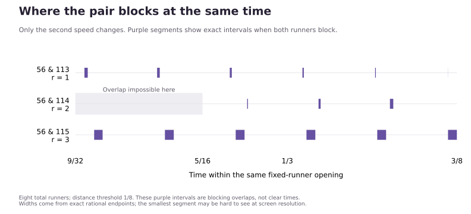

# Local overlap from a slowly changing phase relation

**Date:** September 24, 2026. **Claim status:** OBSERVED for the explicitly listed finite diagnostics; HYPOTHESIS (proof candidate) for the unbounded arguments in Sections 4, 6, and 7; OPEN for arbitrary four added speeds. The derivation is materially AI-generated and awaits independent review. No novelty claim.

## 1. The missing local information

The [ratio investigation](SPEED_RATIOS.md) could not certify the known openings for relative speeds `{1,4,5,56,113,64,72}`. The pair 56,113 is coprime, so the error allowance based on its joint period 1 was too large. A failed lower bound did not mean absence of valid times.

We keep eight total runners, selected reference 0, common start, positive distinct integer relative speeds, and target `delta=1/8`. The fixed core `{1,4,5}` permits all of

$$J=[\alpha,\beta]=[9/32,3/8],\qquad L=3/32.$$

For four other speeds let `D_w` be the blocking duration of w inside J and `T=sum D_w`. Define `E=T-L`. For any selected pair let O be its simultaneous-blocking duration inside J. Group that pair before using the union bound for the other two:

$$U_J\geq L-T+O=O-E. \tag{1}$$

This one-pair inequality avoids overcounting triple overlaps. A positive right side certifies a clear interval exists without first computing the all-seven allowed set. A nonpositive value is inconclusive.

Endpoint phases give each D exactly. For `z>=0`, write `m=floor(z)`, `r=z-m` and define

$$C(z)=\frac m4+\min(r,1/8)+\max(0,r-7/8).$$

Then

$$D_w=\frac{C(w\beta)-C(w\alpha)}w. \tag{2}$$

C accumulates blocking over whole cycles and the two end pieces of the remaining cycle. This uses four endpoint calculations, without intersecting all four blockers.

For `{56,113,64,72}`, these four durations are `11/448`, `11/452`, `3/128`, and `13/576`. Hence

$$E=\frac{1045}{911232}.$$

The pair overlap found below is `O=9/3616`, yielding

$$U_J\geq\frac9{3616}-\frac{1045}{911232}
=\frac{1223}{911232}>0. \tag{3}$$

This closes the specific explanatory gap in our previous bound. The independently computed actual clear duration is larger, `6193/260352`; one pair need not account for all redundancy.

## 2. Why the overlap windows shrink evenly

The useful relation is

$$113-2\cdot56=1.$$

More generally take speeds q and `2q+1`. Near a meeting of the q runner, put `x=qt-j`, with integer j. Their phases relative to the meeting integers obey the exact identity

$$y=(2q+1)t-2j=2x+t. \tag{4}$$

The x coordinate cycles quickly as q grows; the offset from exact doubling advances as t. Coprimality removes a short joint period, but does not remove this simple phase relationship.

On J, if `|x|<1/8`, then

$$1/32<2x+t<5/8.$$

Consequently the second runner can be blocking only near integer `2j`, with `2x+t<1/8`. Both block precisely on the positive-length pieces

$$J\cap\left(\frac{j-1/8}{q},\frac{2j+1/8}{2q+1}\right). \tag{5}$$

Before clipping to J, each positive width is

$$\ell_j=\frac{(3q+1)/8-j}{q(2q+1)}.$$

Consecutive full windows therefore lose exactly `1/[q(2q+1)]` of width. This is an arithmetic progression produced by the affine phase relation. It is not specific to Fibonacci numbers.

For q=56, exactly six windows occur in J; none needs clipping:

| j | Left endpoint | Right endpoint | Width |
| --- | --- | --- | --- |
| 16 | 127/448 | 257/904 | 41/50624 |
| 17 | 135/448 | 273/904 | 33/50624 |
| 18 | 143/448 | 289/904 | 25/50624 |
| 19 | 151/448 | 305/904 | 17/50624 |
| 20 | 159/448 | 321/904 | 9/50624 |
| 21 | 167/448 | 337/904 | 1/50624 |

Their widths sum to `126/50624=9/3616`. Their left endpoints are spaced `1/56` apart, while right endpoints are spaced `2/113` apart. The slightly smaller second spacing explains the steady narrowing. These are simultaneous-blocking windows, not the final clear intervals.

## 3. A countercheck: the same relation also occurs in the tight case

The tight four-blocker example `{6,7,11,13}` contains the near-doubling pair **6,13**, since `13-2*6=1`. Thus the existence of the relation alone cannot guarantee positive clear duration.

In J, that pair's overlap is `[5/16,33/104]` for duration calculations, of length `1/208`; blocking endpoints themselves are excluded. But `E=1445/96096` is larger. The one-pair bound is `-983/96096`, correctly inconclusive.

The full exact check gives **only t=3/8 in J**. Across `[0,1]`, the four odd-eighth times remain valid, with zero total duration. The relation supplies overlap, but its amount must still overcome the other blocking. This is a counterexample to an overstrong positive-duration claim, not to the Lonely Runner Conjecture.

Replacing 13 by 8 leaves actual clear duration `1/112` inside J. Using pair 8,11 gives the lower bound `31/7392>0`. A different useful pair can supply the certificate; the original pair need not be privileged.

## 4. An unbounded family with pair gcd always 1

**HYPOTHESIS — complete proof candidate, independent review pending.** For all distinct positive integer relative speeds

$$\{1,4,5,q,2q+1,u,v\},\quad q\geq310,\quad u,v\geq q,$$

the selected reference has positive clear duration in J. No sharpness or novelty is asserted. This is not an all-reference or general-conjecture proof.

Here is the unbounded argument, separate from the finite diagnostics.

Put `x0=q alpha+1/8`, `y0=q beta+1/8`, `R=y0-x0=qL`. Retain just the full windows in (5) with integer `x0<=j<y0`. They lie wholly inside J and have widths `(y0-j)/[q(2q+1)]`. Any additional clipped window increases the overlap, so it may be ignored for a lower bound.

If `eta=ceil(x0)-x0`, then `0<=eta<1`. Therefore

$$\sum_{x_0\leq j<y_0}(y_0-j)
=\sum_{k\geq0}(R-\eta-k)_+
\geq\sum_{m\geq1}(R-m)_+
=\frac{R^2-R+\{R\}(1-\{R\})}{2}
\geq\frac{R(R-1)}2.$$

It follows that

$$O_J(q,2q+1)\geq\frac{qL^2-L}{2(2q+1)}. \tag{6}$$

This lower bound tends to `L^2/4=9/4096>0` even though `gcd(q,2q+1)=1` for every q. We claim convergence of the **bound** here, not an independently proved asymptotic for every related quantity.

The earlier single-speed period bound gives `D_w<=L/4+3/(16w)`. For these four blockers,

$$E\leq\frac3{16}\left(\frac1q+\frac1{2q+1}+\frac1u+\frac1v\right)
\leq\frac3{16}\left(\frac3q+\frac1{2q+1}\right).$$

Combining this with (1) and (6) yields

$$U_J\geq
\frac{9q^2-2784q-1152}{2048q(2q+1)}. \tag{7}$$

At q=310 the numerator is 708, and (7) is `59/32855040>0`. Writing the numerator as P(q), `P(q+1)-P(q)=18q-2775>0` for q>=310, so positivity holds for all larger integer q. This proves the proposed implication subject to review of the stated argument; it does not rely on enumerating those infinitely many speeds.

The cutoff 310 belongs to a coarse sufficient estimate. The q=56 example is already certified by the more precise local calculation in Section 1. A q=309 diagnostic also has positive clear duration despite the uniform bound being negative.

## 5. Evidence and limits

Run `python -m scripts.analyze_overlap_placement`. [Code](../scripts/analyze_overlap_placement.py) and [exact JSON certificates](../experiments/overlap_placement.json) record all inputs and dependency hashes.

The seven prescribed four-blocker inputs are `(56,112,64,72)`, `(56,113,64,72)`, `(6,7,11,13)`, `(6,7,8,11)`, `(309,619,320,328)`, `(310,621,320,328)`, and `(320,641,328,336)`. No broad scan or time grid was used.

- All 28 single-speed durations agree between the endpoint primitive and direct interval clipping.
- The affine overlap-window formula agrees with general interval intersections in five near-doubling cases, including the tight q=6 case.
- Each complete allowed duration agrees between the closed-interval feasibility checker and a separate partition at all blocking boundaries with strict predicates.
- Six positive-width witness intervals plus the fixed core interval have direct affine endpoint certificates. Four global equality points are retained in the tight control.
- The checks at q=309,310,320 verify arithmetic around the sufficient cutoff; they are not the proof of the infinite statement.

The pair-overlap approach belongs to established mathematics: [S13](SOURCES.md), Perarnau–Serra Propositions 7–8, was re-opened for its geometric derivation. Our local construction is a specialization using the linear relation, the union bound, and arithmetic sums. The existing sources are not claimed to establish our exact cutoff, and no originality search or independent proof review of that cutoff is complete.

The useful correction to our previous framing is that a short full repetition period is sufficient in some families but unnecessary in others. A small integer relation can control **local drift** even when the pair is coprime. The tight q=6 example prevents promoting that observation into a universal positive-duration claim.

**Next question:** for a relation `B-mA=r`, how do m, r, and the location of a fixed-runner opening determine whether its overlap can exceed E? A bounded next comparison would change the residual r from 1 to 2 or 3 while retaining the same threshold and a tight control. This is a proposed next step, not a result already obtained.

Vance directed us to retain the overlap question, seek patterns and counterexamples, and continue the small-gcd investigation. The AI supplied the local derivation, implementation, source comparison, and diagnostic checks. This record contains the research contribution and its limitations; it does not constitute independent corroboration.

## 6. Continuation: residual differences 2 and 3

**September 24, 2026. Status:** OBSERVED for nine prescribed configurations; HYPOTHESIS/proof candidate for the general elementary phase derivation below; arbitrary coverage remains OPEN. Vance approved the bounded comparison of residuals 1,2,3. No new uniform speed cutoff is claimed for residual 2 or 3.

Keep the same core `{1,4,5}`, target 1/8, and interval J. For a pair A=q, B=2q+r, simultaneous blocking gives integers j,k and signed errors

$$x=qt-j,\quad y=(2q+r)t-k,\qquad |x|,|y|<1/8.$$

Writing `m=k-2j`, the residual obeys

$$rt-m=y-2x,\qquad \|rt\|\leq |y-2x|<3/8. \tag{8}$$

Thus **`||rt||<3/8` is necessary for pair overlap**, independently of q. It is not sufficient: the actual fast phase x must also satisfy both blocking inequalities. More generally, for a positive integer multiplier h and `B-hA=r`, simultaneous blocking at threshold delta requires `||rt||<(h+1)delta`. The condition becomes uninformative when its upper bound exceeds the maximum circular distance. This is an elementary norm inequality, not a novelty claim.

### Where overlap is possible

For a fixed t, temporarily allow x to vary through `(-1/8,1/8)`. The length of the x-values satisfying the second blocking condition is

$$K_r(t)=\operatorname{length}\{x\in(-1/8,1/8):\|2x+rt\|<1/8\}
=\min\left(\frac18,\max\left(0,\frac{3/8-\|rt\|}{2}\right)\right). \tag{9}$$

To derive it, choose the nearest integer m to rt when `||rt||<3/8`; there is only one relevant integer because the permitted range has total length 3/4<1. Intersect `(-1/8,1/8)` with `((-1/8-(rt-m))/2,(1/8-(rt-m))/2)`. The overlap grows linearly, has a central plateau, and then declines. This is the same elementary interval-overlap geometry used in the published pair-correlation framework [S13](SOURCES.md), not an independently new principle.

**K is a width in phase space, not a fraction of actual time at that instant.** The trajectory has one particular x, fixed by qt. At `t=1/3`, for example, K_3=1/8, yet both 56 and 115 are distance 1/3 from the reference and neither blocks. A permissible phase region can be missed at a particular time.

On our J, the three profiles are:

| Residual r | Necessary permitted times within J | Possible fast-phase width K_r(t) |
| --- | --- | --- |
| 1 | `[9/32,3/8)` | `(3/8-t)/2`, decreasing to zero |
| 2 | `(5/16,3/8]` | zero through 5/16; then `t-5/16`, increasing |
| 3 | all of J | `(3t-5/8)/2` through 7/24; then constant 1/8 |

For r=2, the residual passes near half a lap at the beginning of J, so the two runners cannot both be within 1/8 of the reference. For r=3, the residual passes through the whole number 1 at t=1/3, allowing a much wider range of simultaneous-blocking fast phases. A repeating permissible region with period 1/r does not imply that the actual pair's blocking schedule has period 1/r.

### Exact windows and a visual comparison

The affine relation constructs every positive-width overlap interval directly:

$$J\cap\left(\frac{j-1/8}{q},\frac{j+1/8}{q}\right)
\cap\left(\frac{2j+m-1/8}{2q+r},\frac{2j+m+1/8}{2q+r}\right). \tag{10}$$

Only integer j and m whose windows reach J need consideration. This examines explicit meeting windows, not a sampled time grid. Endpoints in the JSON are used for durations; blocking inequalities remain strict.

For q=56, the patterns are exact:

- r=1: six shrinking widths `(41,33,25,17,9,1)/50624`, as before.
- r=2: three growing widths `(5,13,21)/25536`. They all occur after 5/16; none can occur earlier in J.
- r=3: one width `107/51520`, followed by five equal widths `1/460`. These matching windows for the faster runner fit wholly inside the slower runner's blocking windows, except for the first partial intersection.

The purple bands show simultaneous blocking. They are not the all-seven clear intervals. No area or width has been enlarged to make a tiny interval visible.

### Does the overlap force room?

Keep the other two added speeds at 64 and 72. Recall `E=T-|J|`; the selected-pair bound is `U_J>=O-E`.

| Pair | Pair overlap O in J | Excess E | One-pair clear lower bound | Actual clear duration |
| --- | --- | --- | --- | --- |
| 56,113 | 9/3616 | 1045/911232 | 1223/911232 | 6193/260352 |
| 56,114 | 13/8512 | -109/153216 | 49/21888 | 7117/306432 |
| 56,115 | 29/2240 | 671/927360 | 2267/185472 | 2729/88320 |

All three lower bounds are positive. But the residual-2 case has **E<0**: its four individual durations already total less than |J|. The ordinary union bound alone certifies at least `109/153216` clear duration, even without using pair overlap. This corrects any interpretation that every local opening needs overlap to explain it.

Residual 3 has much more local overlap here, but clear duration is not proportional to this selected pair's overlap. The other blockers, their concentration, and additional pair or higher-order overlaps still affect the final total.

### Nearby and tight counterchecks

Change q from 56 to 57 while keeping u=64,v=72 and the same three residuals. The order between residuals 1 and 2 reverses:

| q | O for r=1 | O for r=2 | Ordering |
| --- | --- | --- | --- |
| 56 | 9/3616 | 13/8512 | r=1 is larger |
| 57 | 5/2622 | 1/456 | r=2 is larger |

The K profiles are unchanged because they depend only on r and t. Actual overlap also depends on which fast phases the trajectory visits. This is a countercheck against ranking actual overlap by the phase profile alone. Residual 3 still has the largest overlap among the three in both prescribed fast examples; this is a bounded observation, not a universal ranking.

For the smaller q=6, keep u=7,v=11:

| Pair | Selected-pair bound O-E | Actual clear duration in J |
| --- | --- | --- |
| 6,13 | -983/96096 | 0; t=3/8 remains valid |
| 6,14 | -13/616 | 1/112 |
| 6,15 | 31/7392 | 1/112 |

Both last cases have the same allowed set in J: `[17/56,5/16]` together with `{3/8}`. The chosen pair certifies the 6,15 case but not the 6,14 case. This is another explicit reminder that a failed sufficient bound is not complete coverage. The tight first case preserves the distinction between zero duration and no valid time.

### Reproduction and next question

Run `python -m scripts.analyze_residual_overlap`. The standard-library analysis writes [exact certificates](../experiments/residual_overlap.json). Add `--figure` to regenerate the SVG with Matplotlib; rendering is separate from certification. The core checker still has no plotting dependency.

Nine prescribed inputs are the Cartesian product of residuals `{1,2,3}` with `(q,u,v)` equal to `(56,64,72)`, `(57,64,72)`, or `(6,7,11)`. All nine affine window constructions match direct interval intersections; all 36 endpoint durations match clipping; all nine allowed durations match an independent boundary-cell partition. Eight positive-width witness intervals have direct affine certificates. All three small-q cases preserve the valid endpoint 3/8. No broad scan, all-reference check, or new unbounded cutoff for r=2 or r=3 was attempted.

The geometric derivation in S13 was re-opened for comparison. The local residual argument is recorded with AI provenance and pending independent review; no novelty is asserted. The existing q>=310 proof candidate concerns r=1 and is not silently extended to other residuals.

**Next useful question:** can we bound how far actual overlap deviates from the area under K_r(t), using q and r? The exact auxiliary areas are `9/4096`, `1/512`, and `143/12288` for r=1,2,3; these are not the finite-q overlap durations. An explicit error bound could convert the phase picture into speed conditions, while the q=56-to-57 ordering reversal would be a necessary countercheck. The general question of sufficient overlap remains OPEN.

## 7. Continuation: an exact endpoint correction and sufficient cutoffs

**September 24, 2026. Status:** HYPOTHESIS/proof candidate for the formulas and infinite implications below, awaiting independent review; OBSERVED for fifteen prescribed exact diagnostics. Vance approved deriving a discrepancy bound and testing its consequences. This section answers the preceding local question without asserting a general-conjecture result.

The phase area and actual time occupancy are different quantities, but their difference can be written exactly. Put

$$I_1=\frac9{4096},\qquad I_2=\frac1{512},\qquad I_3=\frac{143}{12288}.$$

For every positive integer q and $r\in\{1,2,3\}$, the argument below gives

$$\left|O_J(q,2q+r)-I_r\right|
\leq\frac1{8q}+\frac1{4(2q+r)}. \tag{11}$$

Thus the actual pair overlap tends to the positive phase area as q increases with r fixed. This is an integral statement over J, not a claim of pointwise occupancy or statistical independence. The fixed core and time interval stay fixed; this is not merely rescaling all the runners' speeds.

### Writing the permitted phase as two moving endpoints

On each time piece below, pair blocking is equivalent to the existence of an integer j with $a(t)<qt-j<b(t)$. Outside the listed pieces there is no pair overlap, apart from immaterial duration endpoints.

| r | Time piece | a(t) | b(t) |
| --- | --- | --- | --- |
| 1 | $[9/32,3/8]$ | $-1/8$ | $1/16-t/2$ |
| 2 | $[5/16,3/8]$ | $7/16-t$ | $1/8$ |
| 3 | $[9/32,7/24]$ | $7/16-3t/2$ | $1/8$ |
| 3 | $[7/24,3/8]$ | $7/16-3t/2$ | $9/16-3t/2$ |

These follow by intersecting the signed q-phase interval $(-1/8,1/8)$ with the second blocking interval. Residual 1 uses m=0 in (10); residuals 2 and 3 use m=1. The width b-a is K on each piece. All widths are less than 1, so at most one j contributes at a time.

Except when an endpoint is an integer, the blocking indicator is

$$\lfloor qt-a(t)\rfloor-\lfloor qt-b(t)\rfloor
=(b(t)-a(t))+\{qt-b(t)\}-\{qt-a(t)\}. \tag{12}$$

The excluded times are finite on J: each relevant affine phase has positive slope. They do not change any duration. This convention does not remove valid equality times from the separate closed feasibility calculation.

Define the continuous periodic function

$$P(z)=\tfrac12\{z\}(\{z\}-1),\qquad -1/8\leq P(z)\leq0.$$

Away from integers its derivative is $\{z\}-1/2$. For an affine endpoint $h(t)=st+d$ and time piece $[A,B]$, let

$$W_q(h;A,B)=
\frac{P((q-s)B-d)-P((q-s)A-d)}{q-s}. \tag{13}$$

All slopes s in the table are nonpositive, so q-s>0. Integrating (12) gives the exact formula

$$O_J=I_r+\sum_{\text{time pieces}}
\bigl(W_q(b;A,B)-W_q(a;A,B)\bigr). \tag{14}$$

Only endpoints and the one slope-change time are evaluated; no time grid or list of every fast cycle is required.

### Bounding the correction, including the slope change

For one affine endpoint, the range of P immediately gives

$$|W_q(h;A,B)|\leq\frac1{8(q-s)}.$$

For r=1 or r=2, the two frequencies are q and $c=q+r/2$, yielding (11).

For r=3, the lower endpoint is affine over all J, so its correction has absolute value at most $1/(8c)$. The upper endpoint changes slope at $\tau=7/24$, with frequencies q before tau and c afterward. The phase $qt-b(t)$ is continuous there. Writing its values at the three time endpoints as $z_\alpha,z_\tau,z_\beta$, the total upper correction is

$$\frac{P(z_\beta)}c-\frac{P(z_\alpha)}q
+\left(\frac1q-\frac1c\right)P(z_\tau).$$

The coefficients sum to zero. Their positive coefficients total 1/q and their negative coefficients total -1/q. Because P lies in an interval of width 1/8, this expression lies between $-1/(8q)$ and $1/(8q)$. Adding the lower-endpoint error proves (11) for r=3 as well. This step matters: simply bounding the two upper pieces separately would give a weaker constant.

### Turning the overlap bound into clear time

Retain eight common-start runners with distinct speeds

$$\{0,1,4,5,q,2q+r,u,v\},\qquad u,v\geq q.$$

The selected reference is 0. All seven nonzero speeds are positive integers. The earlier one-speed estimate gives

$$E\leq\frac3{16}\left(\frac3q+\frac1{2q+r}\right).$$

Combining this with (1) and (11) yields

$$U_J\geq F_r(q):=I_r-\frac{11}{16q}-\frac7{16(2q+r)}. \tag{15}$$

For positive q, each subtracted reciprocal decreases strictly as q increases. Consequently F_r is strictly increasing, and checking positivity at a cutoff proves positivity for every larger integer q. These are exact sign brackets:

| r | Cutoff Q from (15) | F_r(Q-1) | F_r(Q) |
| --- | --- | --- | --- |
| 1 | 413 | $-601/348057600$ | $5031/1398992896$ |
| 2 | 464 | $-11/3437312$ | $7/6904320$ |
| 3 | 78 | $-1051/13504512$ | $607/8466432$ |

The **earlier r=1 cutoff 310 remains stronger** and is retained. The added sufficient families are r=2 with q>=464 and r=3 with q>=78. The cutoffs describe these estimates, not the first speeds with clear time. They also do not rank all possible residual configurations.

This gives a partial answer to “what forces enough overlap?” In this fixed-core family, the phase area remains positive while both the overlap discrepancy and the excess blocking allowance shrink like 1/q. Eventually even the worst permitted corrections cannot use up that positive area. The necessary relation alone was insufficient; its quantitative occupancy bound supplies the missing step for this family.

### Counterchecks, exact evidence, and the remaining question

Run **python -m scripts.analyze_phase_discrepancy**. The [script](../scripts/analyze_phase_discrepancy.py) and [exact certificates](../experiments/phase_discrepancy.json) use rational arithmetic throughout. The fifteen prescribed inputs consist of Section 6's nine controls plus (q,r,u,v) equal to:

(412,1,413,414), (413,1,414,415), (463,2,464,465), (464,2,465,466), (77,3,78,79), (78,3,79,80).

- All fifteen endpoint formulas match the separately constructed affine windows and direct blocking-interval intersections.
- All sixty individual endpoint durations match interval clipping. All fifteen complete allowed durations match a separate boundary partition with strict blocking predicates.
- Fourteen positive-width allowed intervals have direct affine certificates. The tight q=6,r=1 control still has zero clear duration and retains the valid equality time 3/8.
- All three immediately-below-cutoff cases have positive actual clear duration despite negative F_r. They directly disprove interpreting these sufficient cutoffs as exact transitions.
- At q=56 the corrections for r=1 and r=2 are respectively 135/462848 and -29/68096; at q=57 they are -1559/5369856 and 7/29184. Their changed signs explain the previously observed ordering reversal. The phase areas themselves did not change.

The fifteen diagnostics check arithmetic and preserve counterpressure; they are not the proof of the unbounded implication. That implication depends on the derivation above, which is materially AI-generated and not independently reviewed.

For literature context, S13's pair-correlation setup and S14's Lemma 4.1 and Bernoulli-polynomial derivation were re-opened on September 24. Here $P=(B_2(\{z\})-1/6)/2$; this is established mathematical machinery. Their full-period formulas are not being cited as proofs of our local cutoffs. No novelty search for these specific sufficient constants is complete, and no novelty is asserted.

**Next useful question:** how much of the conservative error allowance is actually possible at our rational endpoints? Formula (14) suggests organizing its numerator phases by q modulo 32 for r=1, modulo 16 for r=2, and modulo 96 for r=3 (the common denominators of the relevant time endpoints). The reciprocals still depend on q, so the overlap itself is not periodic in q. A finite residue-class argument might sharpen the sufficient conditions without simulating ever larger speeds. That refinement has not been carried out. Arbitrary four-speed coverage and independent proof review remain OPEN.
