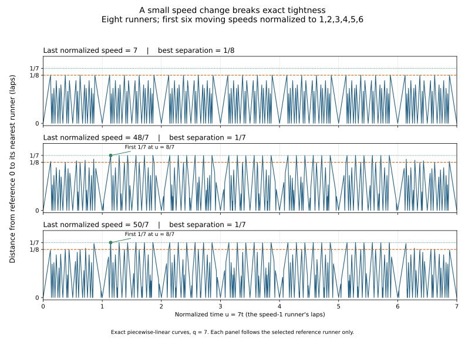

# Breaking exact tightness with one speed change

September 24, 2026. Selected reference runner 0, eight total runners, common start, threshold 1/8. Vance directed the study of exact touches, nearby changes, and significant exceptions. The AI supplied the derivations, code, literature comparison, and checks below.

**Claim status:** finite calculations are OBSERVED exact results. The all-parameter statements have complete elementary arguments below, but remain HYPOTHESIS/proof candidates under this repository's independent-review requirement. The pre-jump mechanism is KNOWN; this application is not claimed new. This is a restricted-family explanation, not a proof for arbitrary speeds or every reference runner.

## 1. The result and why it matters here

For integer q>=2, compare the selected runner's nearest-neighbor distance in

\[
V_{q,s}=\{0,q,2q,3q,4q,5q,6q,7q+s\},\qquad s\in\{-1,0,1\}.
\]

Write \(\|x\|\) for distance to the nearest integer and
\(F_{q,s}(t)=\min_{v\in V_{q,s}\setminus\{0\}}\|vt\|\).

The formulas derived below are

\[
\max_t F_{q,0}(t)=\frac18,
\qquad
\max_t F_{q,-1}(t)=\max_t F_{q,+1}(t)=\frac17.
\]

Dividing speeds by q gives 0,1,2,...,6,7+s/q. The perturbation tends to zero, but the eventual improvement stays 1/56 of a lap. The waiting time explains this: in the normalized clock u=qt, the first 1/7 maximum occurs at approximately q/7. It escapes every fixed time window as q grows. On any fixed time window the distance curves do converge to the tight configuration.

This is significant for our investigation because it identifies a precise mechanism behind room appearing: the six unchanged runners repeat their positions while the exceptional runner gradually changes phase. Neither an extra physical variable nor a simulation over arbitrarily long times is needed. It also corrects a possible overstatement in the preceding notes: a growing core is not itself an obstruction. The correct auxiliary coordinates can still have strict room. A genuinely zero-margin auxiliary system remains outside the earlier strict-margin argument.



The graph follows reference 0 only. All three panels use the same normalized time window [0,7]. Blue curves are exact piecewise-linear lower envelopes; the orange threshold is 1/8 and the green level is 1/7. Fractions are converted to floats only for display.

## 2. An elementary maximum argument, including every maximizing time

### A circle-spacing bound

For any x and integer h>=2, consider the h circle positions
0,x,...,(h-1)x. If positions coincide, some \(\|kx\|=0\). Otherwise one of their h cyclic gaps has length at most 1/h; its endpoints differ by kx for some 1<=k<h. Therefore

\[
\min_{1\le k<h}\|kx\|\le\frac1h.
\]

Equality requires all pairwise circular distances to be at least 1/h, because every pair difference is among these kx. Consequently all cyclic gaps equal 1/h. Since the equally spaced set contains 0, x=r/h modulo 1 with gcd(r,h)=1; conversely these x give equality.

Applying h=8 and x=qt proves the baseline maximum 1/8. Its complete maximizing set on original time [0,1] is

\[
T_q=\left\{\frac{8j+r}{8q}:0\le j<q,\ r\in\{1,3,5,7\}\right\}.
\]

These 4q points are also its entire allowed set at threshold 1/8. They are isolated; there is no positive clear duration.

Applying h=7 to the first six moving runners proves the upper bound 1/7 for either perturbed configuration. Their core attains that bound exactly when

\[
t=\frac{m}{7q},\qquad 7\nmid m.
\]

At such a time,

\[
(7q+s)t=m+st,
\qquad \|(7q+s)t\|=\|t\|\quad(s=\pm1).
\]

Thus the full configuration attains 1/7 exactly at

\[
P_q=\left\{\frac{m}{7q}:q\le m\le6q,\quad 7\nmid m\right\}.
\]

This set is nonempty for every q>=2 and is identical for both signs. Its size is

\[
5q+1-\left(\left\lfloor\frac{6q}{7}\right\rfloor-
\left\lfloor\frac{q-1}{7}\right\rfloor\right).
\]

In particular, put

\[
m_*=\begin{cases}q,&7\nmid q,\\q+1,&7\mid q.\end{cases}
\qquad
t_* = \frac{m_*}{7q},\quad u_* = \frac{m_*}{7}.
\]

This is the earliest 1/7 time. The small exception when 7 divides q comes from a core collision at t=1/7, not numerical noise.

These maxima give strict intervals above 1/8. Every distance curve is v-Lipschitz in t. Since the fastest speed is 7q+s, the closed interval

\[
\left[t_*-\rho,t_*+\rho\right],\qquad
\rho=\frac{1}{112(7q+s)}
\]

has minimum distance at least 1/7-1/112=1/8+1/112. The interval certificates in the data check every runner's affine phase at both endpoints.

## 3. Literature match: a pre-jump preserves the core

S15, Kravitz (2021), Section 2, printed page 5, describes the established pre-jump technique and attributes it to Bienia, Goddyn, Gvozdjak, Sebo, and Tarsi. Adding j/q to time fixes positions of runners whose speeds are divisible by q, while changing the other runners' positions. We inspected that paragraph and the common-factor argument at the start of Theorem 5.2's proof on printed page 10. [Published PDF](https://escholarship.org/content/qt3wx931fh/qt3wx931fh.pdf).

Here is a direct specialization, somewhat broader than the two computed perturbations. Let w be any positive integer coprime to q>=2. At t0=1/(7q), the speeds q,2q,...,6q have minimum distance 1/7. The q times

\[
t_j=\frac{1}{7q}+\frac{j}{q},\qquad 0\le j<q,
\]

leave all six positions unchanged. Coprimality means the last runner's phases \(wt_j\bmod1\) form an equally spaced q-point grid. One grid point lies within 1/(2q) of 1/2, so its distance from 0 is at least

\[
\frac12-\frac{1}{2q}\ge\frac14>\frac17.
\]

Together with the core upper bound, this gives maximum exactly 1/7 for {0,q,...,6q,w}. Our choices w=7q±1 satisfy the coprimality condition. This argument explains why the effect is not peculiar to the symbols +1 and -1. The explicit earliest-time and complete-peak formulas in Section 2 use those particular choices. No additional w configurations were scanned.

The literature match reduces the novelty interpretation of the finding: this is an instructive application of an established mechanism. Our selected-family formulas and implementation still need independent checking; the finite computations are not an independent proof review.

## 4. What happens to every original threshold touch?

At an old time t=(8j+r)/(8q), the first six phases are kr/8 modulo 1 and the last phase is

\[
-\frac r8+st\pmod1.
\]

For s=±1 the last runner never equals the threshold at such a time: equality would require t to be a multiple of 1/4. That would make 8j+r even, contradicting odd r. Thus it either strictly blocks the old time or is strictly safe there.

The exact survival conditions are:

| Old residue r | Last speed 7q+1: survives when | Last speed 7q-1: survives when | If it survives |
|---|---|---|---|
| 1 | t>1/4 | t<3/4 | Opens an interval to the right |
| 3 | t<1/4 or t>1/2 | t<1/2 or t>3/4 | Remains isolated |
| 5 | t<1/2 or t>3/4 | t<1/4 or t>1/2 | Remains isolated |
| 7 | t<3/4 | t>1/4 | Opens an interval to the left |

The inequalities follow by requiring the displayed last phase to be strictly between 1/8 and 7/8 modulo 1. The excluded boundary times cannot be old touches. At residues 1 and 7, only core speed q is on a threshold, respectively leaving or entering its blocking region. At residues 3 and 5, core speeds 3q and 5q lie on opposing thresholds. Those two already prevent a neighboring interval, regardless of the last runner.

For 7q+1 the number opening on each side is floor(3q/4), and the number remaining isolated is
2[floor((q+2)/4)+floor(q/2)]. For 7q-1 the corresponding numbers are ceil(3q/4) and
2[ceil(q/2)+floor((q+1)/4)]. The remaining old touches are blocked.

These are classifications of old times, not counts of all new allowed components. The same global maximum does not imply the same allowed schedule or duration.

## 5. New isolated touches: arithmetic exceptions

The core 1,2,...,6 alone has allowed phases at threshold 1/8

\[
\begin{split}
K={}&[1/8,7/48]\cup[9/32,7/24]\cup\{3/8\}
\cup[17/40,7/16]\\
&\cup[9/16,23/40]\cup\{5/8\}
\cup[17/24,23/32]\cup[41/48,7/8].
\end{split}
\]

This follows by intersecting the six conditions \(kx\bmod1\in[1/8,7/8]\); the script independently checks this fixed rational list. For core speeds q,...,6q, lift each component by t=(j+x)/q. New isolated contacts can occur only at a positive core interval's endpoint, with the last runner imposing the opposite threshold. Interior points where just the last runner is on a threshold have room on one side. The two core singleton types are already old touches.

Solving the opposing endpoint equations gives the complete new-contact classification:

| New time pair in original t | For last speed 7q+1 | For last speed 7q-1 | Other controlling speed |
|---|---|---|---|
| {5/48,43/48} | q=11 mod 48 | q=37 mod 48 | 6q |
| {3/32,29/32} | q=29 mod 32 | q=3 mod 32 | 4q |
| {1/16,15/16} | q=7 mod 16 | q=9 mod 16 | 2q |

For completeness, right endpoints require 7x+st=1/8 modulo 1; left endpoints require 7x+st=7/8 modulo 1. By reflection t->1-t it suffices to check endpoints at or below 1/2:

| Core endpoint x | Required st modulo 1 | Consequence |
|---|---|---|
| 1/8, left | 0 | Would require t=0 or 1, neither compatible with this core phase |
| 7/48, right | 5/48 | Gives the first congruence pair above |
| 9/32, left | 29/32 | Gives the second pair above |
| 7/24, right | 1/12 | Requires 2q=7 or 22q=7 mod 24, impossible by parity |
| 17/40, left | 9/10 | Requires 36q=17 or 4q=17 mod 40, impossible by parity |
| 7/16, right | 1/16 | Gives the third pair above |

For example, at x=7/48 and s=+1, t=5/48. The condition qt=x modulo 1 becomes 5q=7 mod 48, hence q=11 mod 48. For s=-1, t=43/48 and 43q=7 mod 48 gives q=37 mod 48. Reflections supply the partners. For a fixed sign the three rows have distinct residues modulo 16, so at most one pair occurs for each q.

These are exact threshold touches even though the configuration elsewhere exceeds 1/8. Local tightness at a particular time must not be confused with a globally tight runner.

## 6. Concrete controls and openings away from the old touches

| q | s | Old touches blocked | Old touches still isolated | Old touches widened | New isolated touches | Positive intervals containing no old touch |
|---|---|---|---|---|---|---|
| 2 | -1 | 2 | 2 | 4 | 0 | 8 |
| 2 | +1 | 2 | 4 | 2 | 0 | 8 |
| 3 | -1 | 0 | 6 | 6 | 2 | 10 |
| 3 | +1 | 4 | 4 | 4 | 0 | 12 |
| 7 | -1 | 4 | 12 | 12 | 0 | 26 |
| 7 | +1 | 8 | 10 | 10 | 2 | 24 |

All twelve old touches survive when q=3,s=-1, but only six widen. Two new isolated times, 3/32 and 29/32, also appear. This is a counterexample to the simple expectation that perturbation merely widens or deletes existing touches.

For q=7,s=+1, the old time 9/56 is blocked by speed 50: its phase is 1/28. Yet the nearby time 8/49 reaches 1/7. A certified closed interval of radius 1/5600 around 8/49 is strictly safe and contains no old touch. The complete allowed set has 34 positive intervals; 24 contain no original touch. Thus the new openings are not exhausted by following the old equality points.

The two signs can also give different total durations despite having exactly the same maxima and maximizing times. For q=2, the clear durations on [0,1] are 19/260 for s=-1 and 31/480 for s=+1. For q=7 they are 11/168 and 9/140 respectively.

## 7. Small speed changes, long waits, and the correct auxiliary system

In normalized coordinates define

\[
f_{q,s}(u)=\min\bigl(\|u\|,\|2u\|,\ldots,\|6u\|,
\|(7+s/q)u\|\bigr),
\quad
f_0(u)=\min_{1\le k\le7}\|ku\|.
\]

The distance-to-integers function is 1-Lipschitz. Only the last curve changes, so for 0<=u<=T,

\[
|f_{q,s}(u)-f_0(u)|\le\frac{u}{q}\le\frac{T}{q}.
\]

Consequently the maxima on any fixed horizon [0,T] converge to that horizon's baseline maximum. But the eventual maximum for each perturbed tuple is 1/7, while the limiting tuple has eventual maximum 1/8. Eventual maximization over unbounded time need not be continuous in the speeds. The earliest full maximum u*=m*/7 tends to infinity. In original time t, by contrast, t* is approximately 1/7 because all the core speeds grow with q. Mixing these clocks would hide the explanation.

The relevant two-coordinate positions are

\[
x,2x,\ldots,6x,7x+st,\qquad x=qt\pmod1.
\]

The auxiliary system does have strict room: x=1/7,t=1/2 gives core minimum 1/7 and last distance 1/2. The normalized one-dimensional limit drops the slow phase st and is tight. It is not the same auxiliary limit as the two-coordinate system. Our exact witnesses and the pre-jump argument realize actual common-start times; x is never an independently chosen starting position for the physical runners.

## 8. Reproduction, evidence, and what remains

Run from the repository root:

```sh
python -m scripts.analyze_scaled_perturbation
python -m scripts.analyze_scaled_perturbation --figure
```

The first command uses the standard library; the optional figure requires Matplotlib. The initial prescribed values were q=2,3,4,7,14. The controls q=9,11,29,37 were added specifically to exercise the four remaining new-contact congruence classes, rather than scanning a range. All three signs were compared at each value.

The checked-in JSON records 27 complete boundary reconstructions, 27 exact maximum and full peak-set comparisons, 1,392 old-touch classifications, 18 strict affine interval certificates, and 12 new isolated-contact certificates covering all six sign/residue classes. All pass. The two complete allowed-set methods are interval intersection and independent classification of open boundary cells plus boundary points. Exact maxima use a separate corner-and-crossing method and are crosschecked by feasibility at that maximum. These methods share rational primitives; they are computational crosschecks, not an external mathematical review.

All original-time comparisons use [0,1], containing q baseline repetitions and one perturbed period. The data retain every maximizing time and old-touch classification, exact durations and component counts, hashes of complete allowed unions, and explicit new-contact and interval certificates. Source hashes identify the script and imported helpers. The existing checker was not modified, and its wider regression suite was not rerun for this continuation.

This completes the one-speed perturbation question. It does not settle the general overlap question: the core's common factor is a strong simplifying structure, and the pre-jump can adjust one exceptional runner. A useful next question is what happens when several exceptional runners move together under these same time shifts: can they collectively cover every core-preserving choice, and what arithmetic relations prevent that? Begin with a small explicitly chosen family if Vance directs that step. Do not infer a universal guarantee from this one-exceptional-runner result. A genuinely zero-margin auxiliary limit, arbitrary seven-speed coverage by our approach, and independent review remain OPEN.
