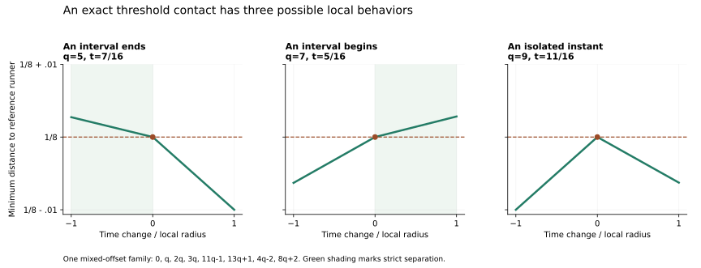

# Signed offsets: local escape and three kinds of threshold contact

September 25, 2026 (UTC). Continuation of [LOCAL_TILING_RULE.md](LOCAL_TILING_RULE.md). AI supplied the derivation, implementation, exact evidence, and figure.

**Status:** specified finite calculations are **OBSERVED**. The uniform extension and general contact classification are **HYPOTHESIS / proof candidates awaiting independent review**. Originality is unestablished. Eight common-start runners, selected reference 0, threshold 1/8; equality counts.

## 1. What changed

Allowing both positive and negative offsets preserves the cyclic gap-growth identity. It changes how actual motion enters those gaps. In particular, an actual contact at a perfect auxiliary tiling need not be isolated: it can begin or end an interval of strict separation.

The argument below gives a conservative uniform sufficient bound **q>=17** for this broader signed class. The earlier positive-offset q>=8 candidate remains intact. We have **not** established that q>=8 fails in the signed class or that seventeen is sharp. The number of runners stays eight; q changes their speeds.



## 2. Physical speeds and signed coordinates

Fix positive integers a_i>=4, b=(1,1,2,2), and signs sigma_i in {-1,+1}. Consider

\[
V_q=\{0,q,2q,3q,a_0q+\sigma_0b_0,\ldots,a_3q+\sigma_3b_3\},
\qquad q\in\mathbb Z,\quad q\ge5.
\]

Put A_i=sigma_i a_i, x=qt modulo 1, and tau=t modulo 1. Sign invariance of circular distance gives

\[
\|(a_iq+\sigma_i b_i)t\|=\|A_i x+b_i\tau\|.
\]

Thus the auxiliary frequencies b_i remain positive, while the coefficients A_i may have either sign. Negative A_i do **not** mean that a physical runner reverses direction. Every physical speed in V_q is nonnegative.

Assume some x0 in (0,1) satisfies:

1. strict core safety: ||kx0||>1/8 for k=1,2,3;
2. the open blockers ||b_i tau+A_i x0||<1/8 tile the phase circle in measure.

The [two-doubled-offset criterion](TWO_DOUBLED_OFFSETS.md) becomes

\[
(A_1-A_0)x0\equiv\frac12\pmod1,
\qquad
\{(A_2-2A_0)x0,(A_3-2A_0)x0\}
\equiv\left\{\frac38,\frac58\right\}\pmod1.
\]

There are six open blocking arcs: two of length 1/4 and four of length 1/8. They leave six allowed equality contacts. Let r_i=A_i/b_i. These four ratios are distinct: equal ratios at equal b produce identical blockers, while equal ratios across b=1 and b=2 produce overlapping blockers around a shared center. Both contradict tiling in measure.

The physical speeds are distinct under these assumptions. For different a_i, a signed-offset difference of magnitude at most four cannot cancel (a_i-a_j)q when q>=5. For equal a_i, equality would require identical signed offsets and hence identical blockers. Each exceptional speed is greater than 3q.

## 3. The invariant and a uniform neighborhood

At a contact c, let r_L belong to the arc ending there and r_R to the arc beginning there. The two boundary velocities as x varies are -r_L and -r_R. Put

\[
\Delta=r_L-r_R,\qquad s=\operatorname{sign}(\Delta).
\]

For epsilon=s h, h>0, a gap opens with exact width |Delta|h. In the other direction those arcs overlap. Summing cyclically over the six contacts gives

\[
\sum\Delta=0,\qquad
K=\frac12\sum|\Delta|>0.
\]

Consequently, until different contact clusters collide, the total auxiliary clear length is

\[
G(x0+\varepsilon)=K|\varepsilon|.
\]

Neither this identity nor the equality of growth on the two sides requires positive A_i. The numbers and positions of openings can differ.

Let M=max_i |r_i|>=4 and let d be the reduced denominator of x0. The tiling congruences imply

\[
8\mid d,\qquad d\le2|A_1-A_0|\le4M.
\]

The first congruence makes x0 rational and d divide 2(A_1-A_0). The 3/8 congruence requires 8 to divide d. Since both 1/8 and each core phase are multiples of 1/d, strict safety gives each core constraint a phase margin of at least 1/d. Hence the distance in x to a core boundary obeys

\[
R_{\rm core}\ge\frac1{3d}\ge\frac1{12M}.
\]

Different contacts are separated by at least 1/8, and the difference between any two boundary velocities has magnitude at most 2M. Choose

\[
\boxed{H=\frac1{16M+1}}.
\]

Then H<1/(16M), so boundaries from different contact clusters remain strictly separated throughout |epsilon|<=H. Also H<R_core. Thus the complete gap description and strict core safety hold throughout this closed neighborhood. The largest individual boundary displacement is less than 1/16. This is a sufficient neighborhood, not a maximal one.

## 4. Reaching a gap with actual motion

At x=x0+s h, actual branches have

\[
\tau_j(h)=\frac{x0+j+s h}{q}.
\]

Use a consistent lift of a contact c and an integer j, and put

\[
d_j=\frac{x0+j}{q}-c,\quad
\ell=-s(r_L+1/q),\quad u=-s(r_R+1/q).
\]

Since s(r_L-r_R)>0, we have ell<u. Subtracting actual branch motion from the gap boundaries gives the exact condition

\[
\boxed{\ell h\le d_j\le u h,\qquad0\le h\le H.}
\]

There are three cases. Entry and exit below are clipped to [0,H]. A strict interval requires entry<exit, and its interior uses strict inequalities.

| Relative boundary slopes | Branches reached | Entry | Exit before clipping |
| --- | --- | --- | --- |
| 0<ell<u | d_j>0 | d_j/u | d_j/ell |
| ell<u<0 | d_j<0 | d_j/ell | d_j/u |
| ell<0<u | either side | d_j/u if d_j>0; d_j/ell if d_j<0 | no second-edge exit |

In the last row, d_j=0 lies strictly inside the expanding gap for every h>0. In the first two rows it is allowed only at h=0. Neither ell nor u can be zero in this scope: |r_i|>=2 and 1/q<=1/5.

At each contact, examine the nearest branch strictly above, the nearest strictly below, and the branch at the contact if present. Farther displacements on the same side cannot enter sooner. These candidates therefore find the nearest positive-length component within the neighborhood, if one exists. “Nearest” measures core-phase displacement from x0 in either direction; it is not the first lonely time after the runners start.

The earlier positive-offset formula rho/(Aq+1) used two boundaries moving in the same direction relative to actual motion. Substituting signed coefficients into that formula without re-deriving these inequalities would miss the third row and mishandle negative denominators.

### Uniform escape for q>=17

Choose a boundary with |r|=M and either contact adjacent to it. In that contact's opening direction, this boundary is an outward extreme of the relative gap: its relative slope is positive and equal to u, or negative and equal to ell. Indeed, r=M is a largest ratio and r=-M a smallest ratio; adding 1/q preserves their respective signs and their order.

Choose the nearest actual branch strictly on that outward side. Its displacement has magnitude at most 1/q. The relative boundary speed is |r+1/q|>=M-1/q, so entry occurs at

\[
0<h_{\rm entry}\le\frac{1/q}{M-1/q}=\frac1{qM-1}.
\]

For q>=17 and M>=4,

\[
h_{\rm entry}\le\frac1{17M-1}<\frac1{16M+1}=H.
\]

The strict inequality follows from M>2. At entry the other edge is strictly separated because ell<u and h_entry>0. There is therefore a nonempty open interval immediately after entry with the actual branch strictly inside the auxiliary gap. The core remains strictly safe. All seven distances exceed 1/8 there.

This is the proposed uniform result: **every coefficient/sign choice satisfying Section 2 has a strict actual witness for every integer q>=17**, with no upper bound on coefficient size. The construction is conditional on the tiling and strict core assumptions.

## 5. A threshold contact need not be a peak

A tiling contact c is an actual time at x0 precisely when qc-x0 is an integer. At such a contact exactly two exceptional constraints are at threshold; the other exceptions and the core are strict.

In normalized coordinates the left-ending blocker has phase +1/8 and the right-starting blocker has phase -1/8. Returning to physical phases multiplies each by its corresponding sign. This gives:

| Neighboring normalized ratios | Physical phases at c | Actual local behavior |
| --- | --- | --- |
| Same sign | 1/8 and 7/8 | Isolated allowed instant |
| r_L>0>r_R | both 1/8 | Interval begins; strict just after c |
| r_L<0<r_R | both 7/8 | Interval ends; strict just before c |

All physical speeds are positive. A phase of 1/8 increases into the allowed region, while 7/8 increases out of it. This proves the stated local behavior under the assumptions, without relying on a sampled plot.

It also identifies the correct arithmetic relation for the two active physical speeds v,w:

\[
\begin{array}{ll}
\text{opposite threshold phases:}&(v+w)c\in\mathbb Z,\\
\text{matching threshold phases:}&(v-w)c\in\mathbb Z.
\end{array}
\]

These are elementary phase identities. They refine the scope of our earlier speed-sum observation: that observation concerned a threshold peak with opposing controllers, not every time at threshold. The identities alone do not establish that all other runners satisfy the threshold or that a configuration is globally tight.

## 6. Prescribed examples and a local failure

The four profiles below were chosen explicitly; there was no coefficient-box scan. Tuples list signed A, while actual speeds use |A_i|q+sign(A_i)b_i.

| Profile | A | x0 | K | M | H | Contact period | Gaps for epsilon positive / negative |
| --- | --- | --- | --- | --- | --- | --- | --- |
| All-negative control | (-4,-12,-10,-22) | 3/16 | 14 | 12 | 1/193 | 8 | 4 / 2 |
| Mixed, unreachable tiling | (4,-4,-6,6) | 3/16 | 14 | 4 | 1/65 | 8 | 4 / 2 |
| Mixed contact types | (-11,13,-4,8) | 3/16 | 30 | 13 | 1/209 | 16 | 4 / 2 |
| Mixed, period 24 | (4,-8,-13,5) | 5/24 | 21 | 8 | 1/129 | 24 | 2 / 4 |

The contact period is the least common multiple of the six contact denominators. It controls the congruence qc-x0 integer, not the entire continuous schedule. All residue classes are retained in the evidence, including classes with no reachable contact.

The first two profiles have no actual tiling contact for any integer q. The mixed contact profile reaches contacts at residues 1,5,7,9,13,15 modulo 16: respectively 3/16 ending an interval, 7/16 ending, 5/16 starting, 11/16 isolated, 15/16 isolated, and 13/16 starting. The period-24 profile reaches contacts at residues 5,11,17,23: respectively 1/24 isolated, 7/24 starting, 13/24 starting, and 19/24 isolated.

For one physical family,

\[
\{0,q,2q,3q,11q-1,13q+1,4q-2,8q+2\},
\]

the complete actual allowed set supplies these three illustrative components:

| q | Contact | Component containing it | Active speeds | Phase relation |
| --- | --- | --- | --- | --- |
| 5 | 7/16 | [145/336,7/16] | 66,18 | both 7/8; (66-18)(7/16)=21 |
| 7 | 5/16 | [5/16,231/736] | 26,58 | both 1/8; (26-58)(5/16)=-10 |
| 9 | 11/16 | singleton {11/16} | 118,74 | 1/8,7/8; (118+74)(11/16)=132 |

The two nondegenerate components have strict interiors. The figure plots the exact piecewise-linear minimum-distance curve within radius 1/(100 max V_q) of each contact. Its six affine pieces are certified against every runner by endpoint inequalities within fixed phase strips; it is not a time-sampled approximation. Horizontal units use each panel's own radius.

**Nearby countercheck:** for A=(4,-8,-13,5), x0=5/24, and q=5, the entire actual allowed set within the certified neighborhood |x-x0|<=1/129 consists only of t=1/24. No positive-length component is reached there, even though G(x0+epsilon)=21|epsilon|>0 for every nonzero epsilon in the neighborhood. Actual speeds are {0,5,10,15,21,39,63,27}. This is a local reachability failure, not a counterexample to the conjecture: the full period has 34 allowed components. It does not refute q>=8 in the signed class.

## 7. Reproduction and evidence limits

From the repository root, with Python and Matplotlib available:

```bash
python -m scripts.analyze_signed_tilings --figure
```

Outputs: [exact evidence](../experiments/signed_tilings.json) and [figure](../figures/signed_tiling_rule.svg). The new script imports the existing checker and geometry helpers without changing them. Evidence records the base commit `3615cdeb8cc99e5d582494108ae3049076cf267b` and SHA-256 hashes of every source dependency.

Checks completed:

- Four signed profiles, eight parametric chambers, 96 affine cells, 384 runner-cell certificates, and 1,536 vertex-phase checks certify the stated local geometry. Twenty-four frozen slices crosscheck the complete phase sets at 0, H/2, and H on each side.
- Twenty-four full actual-set calculations, at q=5,7,9,16,17,18 for each profile, agree with the separately implemented boundary reconstruction. Their restrictions to the local neighborhoods also agree with the full branch-by-branch wedge model. This includes all equality points and verifies nearest-component distances and six reachable-contact classifications.
- One positive-offset compatibility case at q=8 agrees with the same independent full-set reconstruction and the new signed model.
- Four q=100003 cases use direct interval certificates; they do not enumerate the full large-q schedule.
- Forty strict interval certificates and twelve explicit extreme-boundary construction certificates pass. Some certify the same interval by different construction choices; these are not forty independent samples.
- Fifty-six congruence classes are recorded with exact representative phase checks. Six affine sides certify the illustrative distance curves.

There is no global-maximum claim. The wider 25-test regression suite was not rerun because existing helpers were unchanged; these targeted exact crosschecks address the new geometry, reachability, and contact classification. Computational agreement does not independently review the unbounded proof.

## 8. Literature context and next scope

We reread S15 in [SOURCES.md](SOURCES.md): Noah Kravitz, *Barely lonely runners and very lonely runners: a refined approach to the Lonely Runner Problem*, **Combinatorial Theory 1 (2021), paper 17**, December 15, 2021, Section 2, printed pages 4–5. The opposing-half description of local maxima, Proposition 2.1, and the pre-jump paragraph provide established context for separating phase geometry from actual motion. The paper's n counts moving speeds; our n=8 includes the selected reference and its corresponding count is seven. This was a bounded rereading, not a wider novelty audit. The signed uniform construction above is our synthesis awaiting correctness and prior-art review.

What this adds is a reusable signed reachability rule and an explanation of three different contact behaviors. The general conjecture still requires handling arbitrary speed configurations and each reference runner.

A useful next question is whether the **strict core safety** assumption can be relaxed to allow a tiling at a core threshold. Then the core can close an opening immediately, and the present margin argument no longer applies. A targeted examination of that boundary case would test a substantive remaining assumption, rather than merely optimize the conservative cutoff seventeen.
