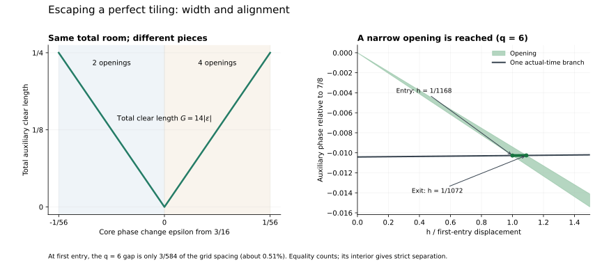

# Escaping a perfect tiling: exact width, alignment, and first contact

September 25, 2026. Approved continuation of [TWO_DOUBLED_OFFSETS.md](TWO_DOUBLED_OFFSETS.md): quantify the opening near its explicit tiling and determine when actual motion reaches it. AI supplied the derivation, code, rational certificates, and figure.

**Status:** OBSERVED for the specified exact computations. The parametric geometry and all-q first-entry formulas are **HYPOTHESIS / proof candidates awaiting independent review**. No novelty claim. Eight common-start runners, reference 0, threshold 1/8; equality counts.

## 1. Scope and the distinction being resolved

Use the fixed family

\[
V_q=\{0,q,2q,3q,4q+1,12q+1,10q+2,22q+2\},\qquad q\in\mathbb Z,\quad q\ge5.
\]

The order displayed preserves the two unit-offset and two double-offset terms; the actual speeds are distinct. This is the changed-coefficient control from the previous note, not that note's entire 96-vector family.

Let x=qt modulo one and x0=3/16. At x0, the auxiliary allowed phases are only

\[
\{0,1/8,3/8,1/2,5/8,7/8\}.
\]

No integer-q actual grid t=(x0+j)/q reaches them. Their denominators divide eight, while x0 has denominator sixteen. The core is strictly safe at x0, so this failure comes from the exceptional runners.

We now derive the **nearest feasible core phase to x0**, allowing a change in either direction. This is not the first lonely time after the race starts, a universal waiting time, or the configuration's global maximum. Once a grid branch j is selected, a core-phase change epsilon corresponds to an actual time change epsilon/q on that branch.

## 2. Exact local geometry

Write x=x0+epsilon and h=|epsilon|. Work in the certified neighborhood

\[
0<h\le H=\frac1{56}.
\]

The core remains strictly safe throughout: its minimum is at least 19/112>1/8. The exceptional positions in the auxiliary phase tau are

\[
4x+\tau,\quad12x+\tau,\quad10x+2\tau,\quad22x+2\tau.
\]

Their threshold boundaries move with slopes -4,-12,-5,-11 as x changes. At the tiling, boundaries meet in pairs; the difference between the two slopes determines whether a gap opens and its width.

For epsilon=+h there are four closed allowed arcs:

| Contact at h=0 | Allowed interval in a lifted phase coordinate | Width |
| --- | --- | ---: |
| 0 | [-11h,-5h], modulo one | 6h |
| 1/8 | [1/8-5h,1/8-4h] | h |
| 1/2 | [1/2-11h,1/2-5h] | 6h |
| 7/8 | [7/8-12h,7/8-11h] | h |

For epsilon=-h there are two:

| Contact at h=0 | Allowed interval | Width |
| --- | --- | ---: |
| 3/8 | [3/8+4h,3/8+11h] | 7h |
| 5/8 | [5/8+5h,5/8+12h] | 7h |

Thus the total clear phase length is exactly

\[
G(x0+\varepsilon)=14|\varepsilon|\qquad(|\varepsilon|\le1/56).
\]

The same total amount of room appears on either side, distributed differently. Its location also moves. Total length alone does not identify the first reachable opening.

At h=0, retain all six original equality phases separately. Taking only the four right-side or two left-side interval limits would lose some of them. At h=H, exact endpoint checks confirm the listed closed intervals remain complete.

This is a local formula. At epsilon=1/55, the exact clear length is 1/4 rather than 14/55. A nearby countercheck therefore rejects extrapolation of the slope beyond the certified neighborhood.

### Why the formulas cover a continuum

The script constructs all twelve affine threshold-boundary lines. On each side of zero it sorts them once inside the proposed neighborhood and verifies their cyclic order by inequalities at h=0 and h=H. Each consecutive pair bounds an affine cell in the (h,tau) plane.

For each runner and each cell, the unwrapped position is affine. The script checks its values at all four endpoint vertices against either [m-1/8,m+1/8] for a blocked region or [m+1/8,m+7/8] for an allowed region. These vertex inequalities certify the entire cell by linearity. The interior classification is strict; coincident boundary vertices at h=0 and h=H are handled by the separate endpoint checks.

There are two chambers, 24 cells, and 96 runner/cell certificates comprising 384 vertex phase checks. This is a finite certificate of the parametric argument, not a dense sampling of epsilon.

## 3. Solve the actual intersection, rather than waiting for a wide gap

At frozen x, the actual choices are

\[
t_j=\frac{x+j}{q},\qquad j=0,\ldots,q-1.
\]

A gap wider than 1/q guarantees an interior grid point. It is sufficient, but unnecessary. We can solve the intersection exactly while a gap is much narrower.

Describe each gap by its contact c, direction s=+1 or -1, and two positive coefficients A>B. For s=+1 its endpoints are c-Ah,c-Bh; for s=-1 they are c+Bh,c+Ah. The six (c,s,A,B) choices are precisely the six rows above.

For s=+1 choose the grid branch immediately below c at h=0:

\[
j=\lfloor qc-x0\rfloor,\qquad \rho=qc-x0-j.
\]

For s=-1 choose the branch immediately above it:

\[
j=\lceil qc-x0\rceil,\qquad \rho=j+x0-qc.
\]

Reduce j modulo q. For contact 0, this corresponds to using the copy at 1 when necessary. The mismatch rho is always a nonzero odd multiple of 1/16. As h increases, the actual grid branch moves in the opposite direction to the opening. Direct substitution gives

\[
h_{\rm enter}=\frac{\rho}{Aq+1},\qquad
h_{\rm exit}=\frac{\rho}{Bq+1}.
\]

Between these values the branch is inside the opening. At either endpoint its minimum distance is exactly 1/8. Farther grid branches have mismatch rho+1,rho+2,..., so none reaches that same opening before the nearest branch.

Taking the minimum over the six entry expressions gives the first feasible displacement from x0. The endpoint order, the grid's motion, and the arithmetic mismatch all enter this formula.

## 4. Eight residue classes determine the first entry

Since every contact c has denominator dividing eight, rho depends only on q modulo eight. Write rho=nu/16. The winning row is:

| q modulo 8 | Direction | Contact c | nu | A | B |
| --- | --- | --- | ---: | ---: | ---: |
| 0 | decreasing x | 5/8 | 3 | 12 | 5 |
| 1 | increasing x | 1/2 | 5 | 11 | 5 |
| 2 | increasing x | 1/8 | 1 | 5 | 4 |
| 3 | decreasing x | 3/8 | 1 | 11 | 4 |
| 4 | increasing x | 7/8 | 5 | 12 | 11 |
| 5 | decreasing x | 5/8 | 1 | 12 | 5 |
| 6 | increasing x | 7/8 | 1 | 12 | 11 |
| 7 | increasing x | 1/2 | 5 | 11 | 5 |

Here nu is an integer mismatch numerator, not a runner count; the total number of runners remains eight. The proposed exact nearest displacement is

\[
h_*(q)=\frac{\nu}{16(Aq+1)},
\]

using the row for q modulo eight. The same branch stays valid up to nu/[16(Bq+1)]. Each entry wins uniquely over the other five candidates for q>=5.

The script certifies the comparisons algebraically. Comparing a winning (nu,A) to another (nu',A') reduces to positivity of

\[
(\nu'A-\nu A')q+(\nu'-\nu).
\]

All forty comparison slopes are nonnegative and their values at q=5 are positive. Together with residue periodicity, this proves the comparisons for unbounded q; the numerical representative of a residue is not being extrapolated without an argument.

All winning entries and exits occur inside the certified neighborhood. Indeed, nu<=5, B>=4, and q>=5 give

\[
0<h_*<h_{\rm exit}\le\frac5{16(4q+1)}\le\frac5{336}<\frac1{56}.
\]

Thus the local analysis supplies a strict witness for every integer q>=5 in this fixed family. Take any interior point of the winning time interval. This all-q claim requires independent review.

## 5. A very thin gap can be reached first

For q=6, the actual speeds are {0,6,12,18,25,62,73,134}. The winning opening begins at contact c=7/8 and moves left as x increases. Its width is h. The grid branch starts just below it, at time 83/96 when x=x0.

It enters at

\[
h_*=\frac1{1168},\qquad t_{\rm enter}=\frac{505}{584},
\]

and exits at

\[
h_{\rm exit}=\frac1{1072},\qquad t_{\rm exit}=\frac{927}{1072}.
\]

The complete time interval between these endpoints is valid, with strict separation throughout its interior. At first entry the gap width divided by the grid spacing is

\[
\frac{1/1168}{1/6}=\frac3{584}\approx0.00514.
\]

That is about **0.51% of one grid spacing**. The gap already contains a valid equality point, and slightly farther motion gives strict separation. A width-only sufficient guarantee would overlook this early contact.

For comparison, q=5 moves in the other direction. It first reaches the opening near 5/8 at h=1/976 and time 311/488. Increasing h moves time backward on that branch, through the exact valid component [265/416,311/488]. The direction is part of the result; these are not claims about a runner reversing its physical motion.



## 6. Two different shrinking scales

The core-phase displacement h_* is proportional to 1/q asymptotically within each residue class. Its additional time displacement from the obstructed branch t=(x0+j)/q is h_*/q, proportional to 1/q squared.

The complete winning time component has exact length

\[
\ell_t=\frac{h_{\rm exit}-h_*}{q}
=\frac{\nu(A-B)}{16(Aq+1)(Bq+1)}.
\]

It likewise shrinks as 1/q squared. This concerns the width and location relative to that particular obstructed branch. The witness time itself is near its contact c and does not thereby approach the start of the race on a 1/q-squared scale.

These shrinking intervals explain a practical hazard for sampled plots: an increasingly fine time grid can still miss a real opening. Exact endpoint calculations retain it. No sampling failure is evidence of failure of the conjecture.

## 7. Verification and limits

Reproduce with:

```sh
python -m scripts.analyze_tiling_escape
python -m scripts.analyze_tiling_escape --figure
```

[The JSON evidence](../experiments/tiling_escape.json) retains the chamber vertex certificates, all residue comparisons, exact entry/exit distances, strict interior certificates, and complete local allowed intervals for the small cases. Arithmetic uses standard-library fractions; optional plotting uses Matplotlib.

For q=5..20, two representatives of each residue class, the complete actual allowed sets are computed by interval intersection and independently reconstructed from boundaries. Their restrictions to every branch with |x-x0|<=1/56 agree exactly with the six-gap model. The nearest feasible phase extracted independently from those complete intervals agrees with h_*. The predicted winning interval is a full component of the actual allowed set.

Eight further checks at q=1,000,000 through 1,000,007 verify direct rational point and interval certificates, with no million-point enumeration. These check formula execution at a different numerical scale; the unbounded claim rests on the chamber and residue arguments.

All 24 strict midpoint/inner-interval certificates and all 24 closed component certificates pass. There are sixteen complete boundary reconstructions, sixteen complete local-model comparisons, sixteen independently extracted nearest-phase comparisons, six frozen controls including both endpoint signs, and one control just beyond the neighborhood. Symmetry-related or repeated controls are not independent samples. Existing helpers and checker were unchanged; the broader regression suite was not rerun. Computational crosschecks do not constitute independent mathematical review.

S15, Kravitz, *Barely lonely runners and very lonely runners: a refined approach to the Lonely Runner Problem*, Combinatorial Theory 1 (2021), paper 17, published December 15, 2021, remains the established pre-jump precedent. Section 2, printed page 5, was revisited. Its technical n counts moving speeds, so our total is n+1. The exact local geometry and first-entry table above are our unreviewed synthesis; no wider literature or novelty audit is claimed.

The next useful question is whether a comparable local escape rule can be expressed for an arbitrary isolated tiling in this four-exception setting: what boundary motions would prevent a strict opening, and what arithmetic controls its first reachable point? The present note establishes only the stated candidate for this one coefficient family.
