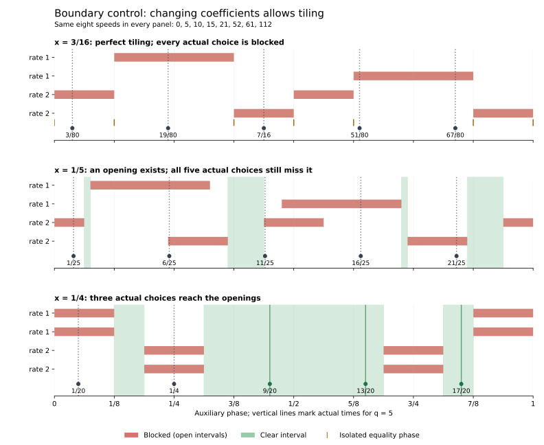

# Two doubled offsets: possible tilings can be arithmetically incompatible

September 25, 2026 (UTC). Continuation of [UNEQUAL_PERTURBATIONS.md](UNEQUAL_PERTURBATIONS.md). The approved next step examines two doubled offsets. AI supplied the arguments, code, exact checks, source comparison, and figure.

**Status:** OBSERVED for the stated finite rational calculations. The tiling classification, parity obstruction, and all-q conclusion are **HYPOTHESIS / proof candidates pending independent review**. No novelty claim. Actual results select reference 0 among eight common-start runners, with threshold 1/8; equality counts.

## 1. The family and the proposed result

Study

\[
V_{q,\mathbf a}=\{0,q,2q,3q,4q+a_4,5q+a_5,6q+a_6,7q+a_7\},
\]

with integer q>=5, exactly two |a_k|=2 and the other two |a_k|=1. All six placements and all sixteen sign choices are included: 96 offset vectors. Adjacent exceptional speeds differ by at least q-4>0; the smallest is at least 4q-2>3q. Thus all eight speeds are distinct. Smaller q are outside this claim.

The proposed conclusion is strict separation above 1/8 for reference 0 at an actual time whose core phase is **either x=1/4 or x=1/5**, for every allowed q and offset vector. Exact profile widths construct the time for sufficiently large q. A complete 48-case remainder handles the smaller values.

The more informative finding is why an auxiliary opening exists: two unit-rate and two doubled-rate blockers can tile for some independent phase choices, but the coefficients 4,5,6,7 make those choices mutually incompatible. This is a property of the specified coefficients, not of common starts in general. An explicit changed-coefficient control below restores tiling while retaining a common start and a strictly safe core.

## 2. Classify the geometrically possible tilings

Let x=qt modulo one and let tau be the auxiliary phase. Multiplying each exceptional position kx+a_k*tau by sign(a_k) preserves its distance to the nearest integer, so its constraint becomes

\[
\|b_k\tau+\phi_k\|\ge\frac18,
\qquad b_k=|a_k|,\quad \phi_k=\operatorname{sign}(a_k)kx\pmod1.
\]

Each rate-one blocker has one open quarter-length arc; each rate-two blocker has two open eighth-length arcs, half a cycle apart. Each runner still blocks total length 1/4. The four lengths sum to one, and continuous clear length G equals redundant blocking R_phase. Hence G=0 requires a tiling in measure, with no positive overlaps.

Name the two unit phases u0,u1 and the two doubled phases d0,d1. The proposed exact tiling criterion is

\[
u_1-u_0\equiv\frac12\pmod1,
\qquad
\{d_0-2u_0,d_1-2u_0\}\equiv\left\{\frac38,\frac58\right\}\pmod1.
\]

The braces require one of each residue, in either order.

For necessity of the first condition, let M(tau) count blockers. If G=0, M=1 almost everywhere. The doubled blockers are half-periodic, so they contribute zero to the first Fourier coefficient. A unit blocker contributes

\[
\int_0^1\mathbf1_{\|\tau+u\|<1/8}e^{-2\pi i\tau}\,d\tau
=\frac{\sin(\pi/4)}{\pi}e^{2\pi i u}.
\]

Thus the two unit contributions must cancel, forcing their phases to differ by 1/2. This is also the geometric requirement that the two quarter arcs lie opposite each other.

Rotate the auxiliary coordinate to y=tau+u0. The unit blockers are now centered at 0 and 1/2, leaving two quarter-length gaps centered at 1/4 and 3/4. Four eighth-length arcs must fill these gaps, two per gap. Their centers are necessarily 3/16,5/16,11/16,13/16. Since each doubled blocker supplies a pair half a cycle apart, its shifted phase must be either 3/8 or 5/8, and the other must supply the other residue. This proves the second condition and also sufficiency.

These equalities describe zero **measure**, not absence of safe points: the open blocking arcs leave their boundary contacts allowed. Merely canceling the first Fourier coefficient is insufficient; the doubled phases must also align.

## 3. Why the coefficients 4,5,6,7 cannot satisfy it

Write the signed coefficients of the unit-rate runners as A0,A1 and those of the doubled-rate runners as B0,B1. Their absolute values partition {4,5,6,7}. Put

\[
d=A_1-A_0,\qquad C=B_j-2A_0
\]

for either doubled runner. The tiling conditions require integers m,n and r in {3,5} such that

\[
dx=\frac{2m+1}{2},\qquad Cx=\frac{8n+r}{8}.
\]

Eliminating x gives

\[
4C(2m+1)=d(8n+r).
\]

Since 8n+r is odd, **d must be divisible by four**. For two distinct absolute values drawn from {4,5,6,7}, the possible nonzero magnitudes of their signed difference are

\[
1,2,3,9,10,11,12,13.
\]

Only 12 is divisible by four. This forces the unit indices to be 5 and 7 with opposite signs. The doubled indices must then be 4 and 6, both even. Therefore C=B_j-2A0 is even.

But substituting d=+12 or -12 into the displayed equation gives

\[
C(2m+1)=\pm3(8n+r),
\]

whose left side is even and right side odd. Contradiction. This excludes tiling at **every real core phase x**, for all 96 offset vectors. It is an arithmetic argument, not an extrapolation from sampled phases.

The exact finite countercheck enumerates every possible x satisfying the first necessary condition: x=(2r+1)/(2|d|), r=0,...,|d|-1. Across the 96 vectors there are 608 such inputs. Every one has positive clear phase length, independently computed by affine interval intersection and boundary-cell classification. Only eight vectors even pass the first divisibility filter. The computation corroborates the written obstruction; it does not replace the all-phase reasoning. Reflected and repeated geometric patterns occur in these counts.

## 4. Actual-time reachability and the complete remainder

At frozen x, actual common-start times are only t_j=(x+j)/q for j=0,...,q-1. Positive auxiliary room alone does not establish a valid t_j.

We use x=1/4 and x=1/5. The core {x,2x,3x} has minimum distance 1/4 and 1/5 respectively. For each offset vector, exact intervals [L,U] in the auxiliary allowed set are computed at both phases. Their endpoints are directly certified against all four affine constraints. Every interior point gives strict separation, because each offset is nonzero.

For width w=U-L, choose tau0=(L+U)/2 and round to the nearest actual time:

\[
j=\left\lfloor q\tau_0-x+\frac12\right\rfloor\pmod q,
\qquad t=\frac{x+j}{q}.
\]

The circular displacement is at most 1/(2q). If q>1/w, t lies strictly inside the interval, while the core positions are unchanged. Thus Q=floor(1/w)+1 is a sufficient integer cutoff. Select the phase with the lower cutoff, breaking ties by smaller x.

| Sufficient cutoff Q | Offset vectors | Cases with 5<=q<Q |
| --- | ---: | ---: |
| 4 | 28 | 0 |
| 5 | 32 | 0 |
| 6 | 32 | 32 |
| 9 | 4 | 16 |
| Total | 96 | 48 |

All q>=9 are covered by rounding; the stronger individual cutoffs leave only 48 cases. All 48 have a strict survivor on at least one of the two prescribed grids. The script selects such a time, checks every distance, and certifies a positive interval around it. It also reconstructs the full actual allowed set by a separately structured boundary method. The smallest selected finite-remainder witness distance is 3/20, strictly above 1/8; this is an observation about these chosen witnesses, not a universal maximum formula.

In this remainder, the quarter-phase grid misses strictness six times and the fifth-phase grid twelve times; they never both miss in the same case. Ninety-six additional rounded diagnostics, one per offset vector at q=max(5,Q), check the construction. The full claim combines the width certificates, unbounded rounding argument, and exhaustive finite remainder. The cutoffs are sufficient, not asserted sharp.

Discrete accounting remains N=q-T+R, where T counts all individual blocking hits and R counts duplicates beyond the first hit at a candidate. The individual bound retains multiplicities: g*ceil(q/(4g)), g=gcd(|a_k|,q). The reused helper checks those bounds and the identity exactly.

## 5. Boundary control: common start alone does not forbid tiling

Change the exceptional coefficients and keep the same offset magnitudes:

\[
\{0,q,2q,3q,4q+1,12q+1,10q+2,22q+2\}.
\]

This is outside the investigated coefficient set. At x=3/16, the core minimum is 3/16>1/8. The unit phases are 3/4 and 1/4; the doubled phases are 7/8 and 1/8. They satisfy the tiling criterion. The complete auxiliary allowed set on the circle is

\[
\{0,1/8,3/8,1/2,5/8,7/8\}.
\]

The JSON also lists 1 as the endpoint copy of 0. All allowed phases have denominator dividing eight. Consequently q*t modulo one also has denominator dividing eight for every integer q. It can never equal 3/16. **Every actual candidate at this core phase is blocked, for every positive integer q**, despite the six allowed auxiliary equality phases and the strictly safe core.

This is not a counterexample to the conjecture: it obstructs only one chosen core position.

For q=5 the actual speeds are {0,5,10,15,21,52,61,112}. Three exact profiles show how the obstruction changes:

| Core phase x | Continuous clear length G=R_phase | T | R | Actual survivors N |
| --- | ---: | ---: | ---: | ---: |
| 3/16 | 0 | 5 | 0 | 0 |
| 1/5 | 7/40 | 6 | 1 | 0 |
| 1/4 | 1/2 | 4 | 2 | 3 |

The middle row sharpens the reachability distinction: even positive **discrete** overlap does not guarantee a survivor. Six blocking hits across five candidates, with one duplicate, still cover all five: N=5-6+1=0. Redundancy must exceed T-q to leave an opening on the grid.

At x=1/4 the three valid times are 9/20,13/20,17/20, all strict. The exact full maximum is 1/4, attained precisely at 9/20 and 11/20; the latter belongs to the reflected core phase x=3/4. The complete maximizing set is crosschecked by interval feasibility at 1/4. Thus a permanent obstruction to one schedule can coexist with substantial separation elsewhere in the same system.



All three panels use the same q=5 control. The figure illustrates the boundary of the family result; it does not depict a member of the coefficient-4,5,6,7 family.

## 6. Reproduction, provenance, and the next question

```sh
python -m scripts.analyze_two_doubled_offsets
python -m scripts.analyze_two_doubled_offsets --figure
```

The analysis uses exact standard-library fractions; optional plotting uses Matplotlib. [JSON evidence](../experiments/two_doubled_offsets.json) records all profile certificates, all 608 tiling-candidate checks, actual witnesses and blocking memberships, source hashes, and the changed-coefficient control.

Passed checks: 192 prescribed family profiles; 608 necessary tiling-candidate profiles, none tiling; 48 complete residual configurations; 96 rounded diagnostics; 144 strict family point/interval certificates; one control point/interval certificate; 49 full actual boundary reconstructions; one full maximum/peak crosscheck; and 291 actual grids containing 1,599 candidate choices. Three auxiliary profiles belong to the same changed-coefficient control. Counts include symmetry-related and repeated geometric cases, not independent samples.

Existing helpers and checker were unchanged. The broader regression suite was not rerun. These checks are not independent mathematical review. No all-reference statement, general maximum formula, novelty claim, or full-conjecture solution follows.

S15, Noah Kravitz, *Barely lonely runners and very lonely runners: a refined approach to the Lonely Runner Problem*, Combinatorial Theory 1 (2021), paper 17, published December 15, 2021: revisited Section 2, printed page 5, on pre-jumps. The technical n counts moving speeds; our total is n+1. This supports the known core-preserving time-shift method. The tiling criterion, parity specialization, and finite reduction above are our AI-generated synthesis awaiting review. The earlier affine-family note already used a lowest-frequency obstruction; cancellation was never claimed sufficient. No wider literature/novelty audit was performed this turn.

The next useful question is quantitative: in the explicit changed-coefficient control, **how quickly does an opening grow as x moves away from the exact tiling at 3/16, and when must an actual time grid reach it?** That would connect the tiling classification to a local escape bound. It is a proposed next scope, not established here.
