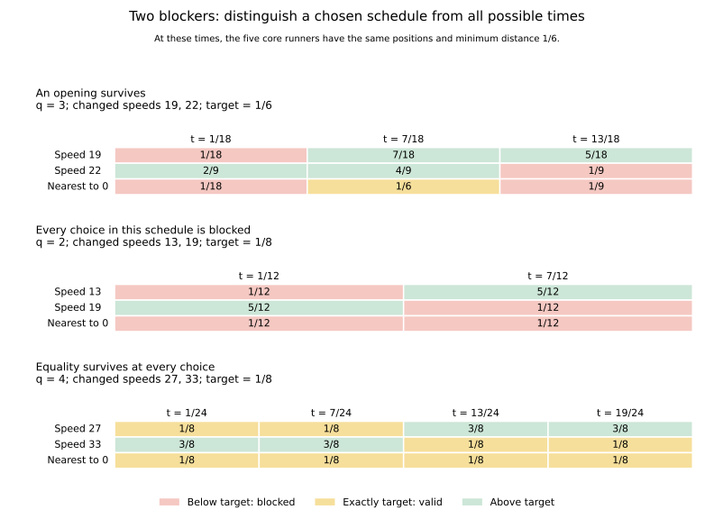

# Two changed runners: covering a schedule versus covering all time

September 24, 2026. Eight common-start runners; reference 0; the conjecture threshold remains 1/8 throughout. Vance approved the next question: can several changed runners jointly block the choices supplied by a core-preserving time shift? The AI supplied the following derivations, implementations, counterexamples, and source comparison.

**Status:** OBSERVED for the explicitly checked rational configurations. The general formulas and counting arguments are HYPOTHESIS/proof candidates pending independent review. The pre-jump technique is KNOWN. No novelty, arbitrary-speed theorem, or all-reference conclusion is claimed.

## 1. Answer and scope

For the next small family, set

\[
V_{q,a,b}=\{0,q,2q,3q,4q,5q,6q+a,7q+b\},
\qquad q\ge3,\quad a,b\in\{-1,1\}.
\]

The five unchanged moving runners are the core. For all four sign choices, the argument below gives selected-reference maximum **exactly 1/6**. The eight-runner threshold is still 1/8; attaining 1/6 is extra room. We restrict q>=3 so every sign choice has eight distinct speeds: at q=2,a=1,b=-1 the two changed speeds both equal 13.

Two countercontrols delimit the claim:

- With q=2 and exceptional speeds 13,19, the two runners jointly block every core-optimal time even at the original threshold 1/8. Nevertheless t=1/7 is valid, and the full maximum is 1/7.
- With q=4 and exceptional speeds 27,33, every core-optimal time survives at exactly 1/8, but none reaches 1/6. The full maximum is 6/37, attained elsewhere.

Thus two runners can cover an entire chosen schedule. Covering that schedule is not covering all time. Also, the suggestive progression 1/8 -> 1/7 -> 1/6 from zero, one, and two unit perturbations is not a universal rule based only on how many speeds changed. The second countercontrol disproves that extension.



The displayed entries are exact distances from reference 0. The target is stated separately in each panel. Equality is valid. The image displays one core phase per configuration; the data also check its reflected phase.

## 2. Replace a long time search with a finite set of repeated positions

Let \(\|z\|\) denote distance to the nearest integer. Freeze a core phase x and consider

\[
t_j=\frac{x+j}{q},\qquad j=0,\ldots,q-1.
\]

For each core speed kq,

\[
kq\,t_j=kx+kj\equiv kx\pmod1.
\]

All five core positions are therefore identical at every one of these q times. An exceptional runner with integer speed w has phases

\[
wt_j=\frac{wx}{q}+\frac{wj}{q}\pmod1.
\]

If gcd(w,q)=1, these are q equally spaced phases in a permuted order. We are not changing starting positions: these are actual times on the common-start trajectory. This is the established pre-jump mechanism described in S15, Section 2.

At a target distance d, define B1 and B2 to be the sets of indices j blocked by the two exceptional runners, using the strict condition distance < d. If the core is safe at x, the number of surviving choices is exactly

\[
N=q-|B_1|-|B_2|+|B_1\cap B_2|.
\]

This is the discrete counterpart of our earlier local-duration accounting. It separates three questions: how many choices each runner can block, how much their blocking overlaps, and whether the chosen core phase leaves any survivors.

## 3. A counting bound that works without forced overlap

For 0<d<1/2, an open circle arc of length 2d contains at most ceil(2dq) points of an equally spaced q-point grid. To see the endpoint issue, if r grid points lie in such an arc, the distance from the first to the last is at least (r-1)/q and strictly less than 2d, giving r<=ceil(2dq). The open arc is essential: threshold equality is safe.

For two exceptional speeds individually coprime to q, this gives

\[
N\ge q-2\lceil2dq\rceil.
\]

At the eight-runner threshold d=1/8,

\[
N\ge q-2\left\lceil\frac q4\right\rceil>0
\qquad(q\ge3).
\]

The strict positivity follows directly by writing q=4k+r, 0<=r<4; q=2 is the small boundary where the bound is zero. Consequently, **for any core-safe starting time, any q>=3, and any two exceptional speeds individually coprime to q, at least one of the q core-preserving choices survives at 1/8**. The five core speeds need only be multiples of q for this implication; the consecutive structure is not needed in this counting step.

This answers the overlap question in this particular regime: enough overlap need not be forced, because even disjoint blocking sets cannot exhaust the choices. On a coarse grid where the bound reaches zero, exact overlap can matter. The q=2 counterexample below has zero overlap and no surviving index.

For completeness, coprimality can be removed from the formula, but the guarantee can then disappear. Put g_i=gcd(w_i,q) and m_i=q/g_i. Runner i visits m_i distinct phases, each repeated g_i times, so

\[
|B_i|\le g_i\lceil2dm_i\rceil,
\qquad
N\ge q-\sum_{i=1}^2g_i\lceil2dm_i\rceil.
\]

The baseline exceptional speed 6q illustrates why this matters: at x=1/6 it stays at phase 0 for every j and blocks every choice. Common factors determine the effective number of phases, not merely the magnitudes of the speeds.

At the stronger target d=1/6, the coprime bound is q-2ceil(q/3). This is positive for every q>=3 except q=4, as seen by splitting q modulo 3. For our consecutive five-runner core, this already proves attainment of its 1/6 ceiling for any two coprime exceptions when q>=3,q!=4. The q=4 countercontrol shows that the missing guarantee can correspond to an actual loss of the ceiling. The structured ±1 family handles q=4 as well, by the phase calculation below.

## 4. The ±1 family: an exact all-q argument

### Upper bound from the unchanged core

The six circle positions 0,x,2x,...,5x have a cyclic gap at most 1/6. Its two endpoints differ by kx for some 1<=k<=5, so

\[
\min_{1\le k\le5}\|kx\|\le\frac16.
\]

Equality requires all six points equally spaced, hence x=1/6 or 5/6 modulo 1. This is the circle-spacing argument from SCALED_PERTURBATION.md, now with six points. It caps the full eight-runner configuration at 1/6.

### A whole half interval of safe exceptional phases

Take x=1/6. At t_j=(1/6+j)/q, the exceptions have phases

\[
(6q+a)t_j\equiv a t_j,
\qquad
(7q+b)t_j\equiv\frac16+b t_j\pmod1.
\]

Because a=±1, the first distance is simply ||t_j||. Both exceptions meet 1/6 exactly when

\[
t_j\in I_b,
\qquad
I_{+1}=[1/6,2/3],\quad I_{-1}=[1/3,5/6].
\]

Each interval has length 1/2. The times t_j are spaced 1/q<=1/3, so this interval contains a choice for every q>=3. A direct construction avoids any search: if L_b is the left endpoint, choose

\[
j_* = \left\lceil qL_b-\frac16\right\rceil,
\qquad
\widehat t=\frac{1/6+j_*}{q}.
\]

Then 0<=j_*<q and
\(L_b\le\widehat t<L_b+1/q\le\sup I_b\).
The core and both exceptions all meet 1/6. Together with the upper bound, this proves the proposed maximum formula for every integer q>=3 and all four sign choices. No conclusion about infinitely many q is inferred from the finite checks.

Every such witness also supplies a strict interval at threshold 1/8. If M is the largest speed, then all distances are at least 1/6-1/48=7/48>1/8 on

\[
\left[\widehat t-\frac{1}{48M},\widehat t+\frac{1}{48M}\right].
\]

This follows from the speed bound on distance changes. The exact certificates separately check every affine phase at both endpoints.

### All maximizing times and the waiting-time pattern

The core equals its ceiling only at t=m/(6q), m=1 or 5 modulo 6. At these times the first exceptional distance is ||t||, and the second is ||m/6+bt||. Thus the complete maximizing set on original time [0,1] is described by:

| b | Residue of m modulo 6 | Inclusive range for m |
|---|---|---|
| +1 | 1 | q<=m<=4q |
| +1 | 5 | 2q<=m<=5q |
| -1 | 1 | 2q<=m<=5q |
| -1 | 5 | q<=m<=4q |

The sign a does not affect the peak value or the complete set of peak times. This does not assert that it leaves the whole time course or clear duration unchanged.

Let r_b=1 for b=+1 and r_b=5 for b=-1. The earliest peak has

\[
m_*=q+((r_b-q)\bmod6),\qquad
t_*=\frac{m_*}{6q},\qquad
u_*=qt_* = \frac{m_*}{6}.
\]

For q>=5 the first candidate in the range beginning at q is no later than 2q, so it precedes the other row; q=3 and 4 give the same formula by direct substitution. Therefore q/6<=u_*<q/6+1. The periodic correction depends on q modulo 6.

After dividing all speeds by q, both perturbations have magnitude 1/q. Their eventual maximum remains 1/6, compared with baseline 1/8, while the first full maximum moves out to approximately q/6 in the normalized clock. On every fixed horizon [0,T], the nearest-distance curves still differ from the baseline by at most T/q, since each changed curve changes by at most that amount and taking a minimum preserves this bound.

## 5. Two deliberately constructed countercontrols

### q=2: all core-optimal choices fail, yet another time works

Use speeds {0,2,4,6,8,10,13,19}. For x=1/6, the two core-preserving times are:

| Time | Distance of speed 13 | Distance of speed 19 | At least 1/8 from both? |
|---|---|---|---|
| 1/12 | 1/12 | 5/12 | No |
| 7/12 | 5/12 | 1/12 | No |

Here |B1|=|B2|=1 and |B1 intersection B2|=0. Together they cover all q=2 choices. Reflection t->1-t gives the other core-optimal phase x=5/6, and both of those times fail too. This exhausts every time when the core reaches 1/6.

Nevertheless at t=1/7 the seven moving-runner distances, in the displayed speed order, are

\[
(2,3,1,1,3,1,2)/7.
\]

The full maximum is exactly 1/7, with all eight maximizing times recorded and independently crosschecked by the exact checker. The seed core phase changes from 1/6 to 2/7; the surviving time was outside the proposed schedule.

### q=4: equality at 1/8 is not failure

Use speeds {0,4,8,12,16,20,27,33}. For x=1/6:

| Time | Distance of speed 27 | Distance of speed 33 | Full minimum |
|---|---|---|---|
| 1/24 | 1/8 | 3/8 | 1/8 |
| 7/24 | 1/8 | 3/8 | 1/8 |
| 13/24 | 3/8 | 1/8 | 1/8 |
| 19/24 | 3/8 | 1/8 | 1/8 |

At target 1/6, the blockers partition the four indices into {0,1} and {2,3}. At threshold 1/8, neither runner blocks any index. Every time is valid at equality. Reflection covers the other core-optimal phase, so no core-optimal time can attain 1/6.

The global maximum is exactly 6/37 at t=17/37 and 20/37, above 1/8 but below 1/6. Those values are bounded exact results, not an asserted formula for other exceptional speeds. This control simultaneously checks the q=4 counting exception, the role of equality, and the limit of extending the ±1 result to arbitrary coprime exceptions.

## 6. Literature and the remaining overlap question

S15's pre-jump paragraph was revisited. A closer two-exceptional-runner precedent is Ho Tin Fan and Alec Sun, *Amending the Lonely Runner Spectrum Conjecture*, Electronic Journal of Combinatorics 33(1) (2026), P1.38, published February 27, 2026. We read Lemma 23 and its proof, printed pages 12–13, plus the Section 5.3 case split. Their modular lemma has different hypotheses and a 1/4 target; it excludes equal or opposite speed residues. Our ±1 exceptions have exactly that excluded residue relation. It is related methodology, not a theorem we can substitute verbatim. No full-paper audit or novelty conclusion. See S17 for the source link and reading scope.

The present study does not show what universally forces overlap. It identifies a regime where a counting budget already leaves a survivor, and a boundary case where a fixed schedule really is covered. With four coprime exceptional runners at threshold 1/8, the same crude bound becomes q-4ceil(q/4), which is never positive. That reconnects to the earlier four-runner blocking/tiling problem: at that budget, overlap, correlations, or changing the core phase must supply information missing from individual counts.

A focused next step would examine a small four-exception family where this count is inconclusive, tracking the exact discrete overlap and the available core phases together. Do not infer a universal cover obstruction, or authorize a broad scan, from this suggestion. Independent review and the genuinely zero-margin auxiliary case remain unresolved.

## 7. Reproduction and verification scope

```sh
python -m scripts.analyze_two_perturbations
python -m scripts.analyze_two_perturbations --figure
```

The analysis uses standard-library exact fractions; optional plotting requires Matplotlib. The family checks are q=3,4,5,6,7,8,12, each with all four sign choices. The first six q values cover the six residue classes in the earliest-time formula; q=12 checks a doubled multiple of 6. The only extra full configurations are the two countercontrols above and an unchanged q=3 baseline. The invalid duplicate-speed q=2 sign combination is recognized, not silently counted as an eight-runner case.

All 31 full maximum/complete-peak comparisons and all 31 independent boundary reconstructions pass. There are 124 grid profiles, 756 classified choices, 248 individual discrete-count bounds, and 30 strict interval certificates. The baseline alone retains zero clear duration. Both reflected core-optimal phases are checked at both 1/8 and 1/6.

The JSON retains every maximizing time, every grid membership, exact counts/durations, complete-union hashes, witness certificates, input selection rationale, and source hashes. Complete allowed sets are reconstructed by interval intersection and by classification of open cells plus boundary points. Maxima use exact affine corners/crossings and are checked against feasibility at the computed value. Shared rational primitives and AI-generated arguments do not constitute independent mathematical review. Existing checker/helpers were unchanged, and the broader regression suite was not rerun for this continuation.
