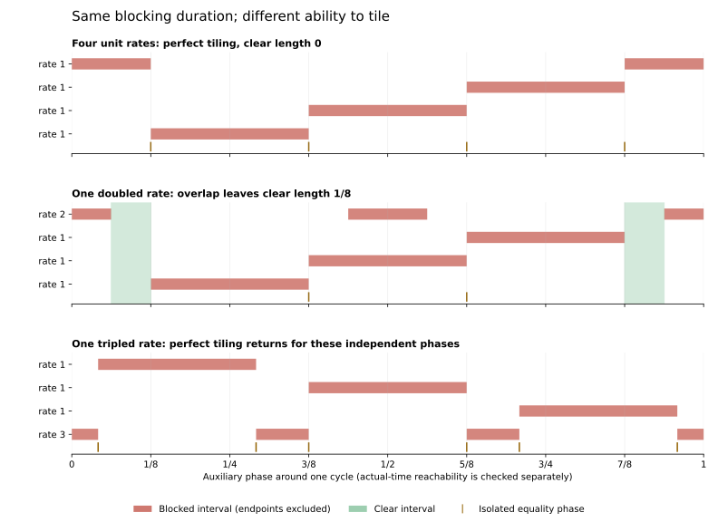

# Unequal changes: the sizes of the blocking pieces matter

September 25, 2026. Continuation of [FOUR_PERTURBATIONS.md](FOUR_PERTURBATIONS.md), following approval to examine unequal changes. AI supplied the arguments, code, exact calculations, source comparison, and figure.

**Status:** OBSERVED for the specified exact finite calculations. The tiling lemma and all-q conclusion are **HYPOTHESIS / proof candidates pending independent review**. No novelty claim. All actual-runner conclusions concern reference 0 among eight common-start runners; the threshold is 1/8 and equality counts.

## 1. What changed, and what survived

We study precisely

\[
V_{q,\mathbf a}=\{0,q,2q,3q,4q+a_4,5q+a_5,6q+a_6,7q+a_7\},
\]

where q is an integer at least four, exactly one |a_k| is two, and the other three magnitudes are one. All signs and all four positions are included: 4*16=64 offset vectors. The q>=4 restriction keeps every speed positive and distinct: adjacent exceptional speeds differ by at least q-3>0, and 4q-2>3q. Some smaller q have collisions; they are outside this claim.

The proposed conclusion is **strict separation above 1/8 for the selected reference in every configuration of this family**. We construct actual times for sufficiently large q for each offset vector, then certify the complete 44-case remainder. This is not an all-reference result or an arbitrary-offset theorem.

The important change is geometric. A doubled offset blocks twice during one auxiliary phase cycle, in two intervals each half as long. Its total blocking duration is unchanged. Those pieces cannot fit perfectly with the three remaining quarter-length intervals. Overlap, and therefore an auxiliary opening, is forced.

But fragmentation is not automatically helpful: a tripled-rate geometric control can tile perfectly. The sizes and spacing of the pieces matter.



The first two panels use x=1/4 and offset vectors (1,1,1,1) and (2,1,1,1). The last panel deliberately allows independent phases to test the geometric explanation. It is not a common-start configuration in the family above. These are auxiliary phase pictures; actual-time reachability is checked separately below.

## 2. The invariant blocking budget

As before, freeze x=qt modulo one and introduce an auxiliary phase tau. The exceptional positions become

\[
kx+a_k\tau\pmod1.
\]

Actual times at this fixed core position remain exactly

\[
t_j=\frac{x+j}{q},\qquad j=0,\ldots,q-1.
\]

An offset with magnitude m produces m open blocking arcs, each of length 1/(4m), evenly spaced by 1/m. The sum of their lengths is always 1/4. The sign changes the orientation and position, not that total.

Thus the four individual blocking durations still add to one. If M(tau) counts blockers, clear phase length G and redundant blocking R_phase satisfy

\[
G=\int_0^1\max(M(\tau)-1,0)\,d\tau=R_{\rm phase}.
\]

This identity survives unequal nonzero integer offsets. Equal total duration does not imply equal ability to cover the circle: component widths, locations, and periodicity remain essential.

## 3. A divisibility obstruction to perfect tiling

Consider three rate-one blockers and one rate-m blocker, with arbitrary independent phase shifts, at threshold 1/8. The rate-one blockers each have one open arc of length 1/4. The rate-m blocker has m open arcs of length 1/(4m).

**Proposed geometric lemma:** their clear phase set has zero measure only if m divides three. Conversely, independent phase choices allowing zero clear measure exist for m=1 and m=3.

To see necessity, suppose G=0. The total individual length is one, so R_phase=0. No two blocking arcs can overlap in a positive interval. Between consecutive rate-m arcs, the remaining gap has length

\[
\frac1m-\frac1{4m}=\frac3{4m}.
\]

The other three arcs must fill these gaps without overlap or positive-length holes. Each whole quarter arc lies within a single gap; it cannot cross the interior of a rate-m arc. Therefore each gap must contain an integer number r of quarter arcs, with

\[
\frac r4=\frac3{4m},\qquad r=\frac3m\in\mathbb Z.
\]

This requires m=1 or m=3. For m=2, perfect tiling is impossible for **any** phase choices, not only the quarter and fifth phases used in our calculations. Since the sets have finitely many interval endpoints, failure of tiling leaves a positive-length opening, not just an equality point.

The endpoint qualification matters: even a perfect tiling by open arcs leaves boundary points valid. Zero clear measure does not mean no allowed phases.

For m=1, four adjacent quarters give the earlier tiling. For m=3, place its three arcs at centers 0,1/3,2/3, each with radius 1/24. Place the unit arcs at centers 1/6,1/2,5/6. Each gap between the short arcs has length 1/4 and receives one unit arc. The exact allowed set consists of six isolated points:

\[
\{1,7,9,15,17,23\}/24.
\]

The script verifies this control by interval intersection and a separate boundary-cell reconstruction. It disproves the geometric claim that splitting one blocker into more pieces always forces an opening. It says nothing by itself about an actual common-start family with offset magnitude three.

## 4. Turn a phase opening into an actual time

The preceding lemma supplies an opening but not a uniform size or an actual time. We use the two prescribed core phases x=1/4 and x=1/5. Their core minimum distances are 1/4 and 1/5, both above 1/8.

For each of the 64 offset vectors, exact interval intersection supplies an allowed interval [L,U] at each chosen phase. Boundary-cell classification separately reconstructs the complete auxiliary allowed set. We also directly certify every chosen interval: for each exceptional runner, kx+a_k*L and kx+a_k*U have the same integer part, and both fractional parts belong to [1/8,7/8]. Linearity proves the whole interval valid. Because a_k is nonzero, every interior point of the chosen interval gives strict separation for that runner.

Write w=U-L and tau0=(L+U)/2. The actual time grid has circular spacing 1/q. Choose

\[
j=\left\lfloor q\tau_0-x+\frac12\right\rfloor\pmod q,
\qquad t=\frac{x+j}{q}.
\]

Its circular distance from tau0 is at most 1/(2q). If q>1/w, it lies strictly inside the allowed interval. The core positions remain fixed exactly, and all seven moving runners are strictly farther than 1/8 from reference 0.

The sufficient integer cutoff is Q=floor(1/w)+1. For each vector we select whichever of the two profiles gives the smaller cutoff, breaking ties by smaller x. These widths already account for the different rates; no incorrect unit-rate Lipschitz estimate is applied to the doubled offset.

The complete, reproducible cutoff table is:

| Sufficient cutoff Q | Number of offset vectors | Remaining q>=4 cases below Q |
| --- | ---: | ---: |
| 3 | 8 | 0 |
| 4 | 32 | 0 |
| 5 | 12 | 12 |
| 6 | 8 | 16 |
| 7 | 2 | 6 |
| 9 | 2 | 10 |
| Total | 64 | 44 |

All vectors therefore have a constructed actual witness for every q>=9. Stronger vector-specific cutoffs leave only 44 configurations requiring a separate certificate. The cutoff is sufficient, not claimed sharp.

For each of those 44 cases, the script computes the full actual allowed set by interval intersection and separately by boundary reconstruction. It takes the midpoint of a positive component, checks every distance exactly, and directly certifies a closed interval around that witness. All pass with strict separation. One rounded diagnostic for each vector adds 64 checks at q=max(4,Q); these diagnostics illustrate the construction and do not replace its argument.

The combination of the 64 exhaustive profile certificates, the rounding argument for unbounded q, and the 44 exhaustive remainder certificates is the proposed complete proof for this restricted family. It is not extrapolation from a range of sampled scales.

## 5. Two failure modes worth preserving

**Positive openings can still miss the actual grid.** Eight configurations in the finite remainder have no strict survivor at either x=1/4 or x=1/5. Seven retain equality at the quarter phase; one has no survivor at either phase. Equality is valid for the conjecture, but does not certify our stronger strictness claim.

The latter configuration has q=5 and offsets (-2,1,-1,1), giving actual speeds

\[
\{0,5,10,15,18,26,29,36\}.
\]

Both auxiliary pictures have a positive opening, yet every actual grid choice is blocked. Elsewhere in time the exact full maximum is 7/31, attained in particular at t=11/31. All distances there are at least 7/31; its core phase is 24/31, outside the two preset choices. The exact maximum and all its peak times are independently crosschecked by feasibility at that value. This extends the earlier reachability distinction to unequal offsets.

The eight missed-strictness cases have maxima 7/31, 8/37, 5/23, 1/5, 1/5, 3/13, 3/13, and 10/47; the JSON associates each value with its exact input and complete maximizing set. No maximum formula for the whole family is claimed.

**The old coprime counting bound can fail.** At q=4, x=1/5, offsets (2,-1,1,-1), the doubled runner has actual speed 18. The four candidate times are 1/20,3/10,11/20,4/5. This runner's distances are 1/10,2/5,1/10,2/5: it blocks two choices, exceeding the previous unit-offset bound ceil(q/4)=1.

The reason is gcd(2,4)=2: its phase repeats on this grid. More generally, for g=gcd(|a_k|,q), there are q/g distinct equally spaced positions, each repeated g times. The valid individual bound is

\[
|B_k|\le g\left\lceil\frac{q}{4g}\right\rceil.
\]

An open arc of length 1/4 contains at most ceil((q/g)/4) of the distinct positions. The script checks this bound and the exact discrete identity N=q-T+R for every retained actual grid. The continuous budget remains 1/4 even when these discrete counts change.

## 6. Evidence, sources, and next question

Run from the repository root:

```sh
python -m scripts.analyze_unequal_perturbations
python -m scripts.analyze_unequal_perturbations --figure
```

Exact computation uses standard-library fractions; optional plotting uses Matplotlib. [The JSON evidence](../experiments/unequal_perturbations.json) retains all chosen endpoints, affine endpoint certificates, witnesses, blocking memberships, source hashes, and the eight complete peak sets.

Completed checks: 128 frozen family profiles, 44 complete actual boundary reconstructions, 108 strict actual point/interval certificates, eight maximum/full-peak crosschecks, 216 actual-grid profiles containing 1,020 candidate choices, and three geometric controls. Sign-related and geometrically repeated cases are included; these are not counts of independent samples. Existing helpers and the checker were unchanged, and the broader regression suite was not rerun. Computational crosschecks are not independent mathematical review.

S15, Kravitz (2021), Section 2, printed page 5, was revisited for the established pre-jump method. The journal paper was published December 15, 2021. Its technical n counts moving speeds, hence our total is n+1. The source supports the core-preserving time shifts, not a claim that this tiling lemma or family classification is new. The previously checked-in affine-family helper already supports mixed auxiliary winding rates and supplies the interval crosscheck used here. This continuation makes no wider literature or novelty audit claim.

The next useful case is **two offsets of magnitude two and two of magnitude one**. Earlier mixed-winding controls show that such rates can tile for suitable auxiliary phases. The question would be whether the phase constraints imposed by the common-start family force an escape from those tilings, and whether that escape is reachable. That is a proposed next scope, not a result of this note.
